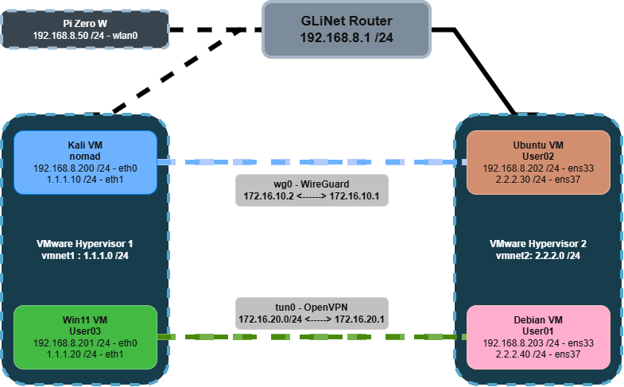

# Lab Setup
 
VM-based lab and setup notes:
 
---
 
## Network Config
 
| Machine | Hostname | 							IPs	 			    |      Tunnel      | 
|---------|----------|------------------------------|------------------| 
| Kali    | nomad    | 192.168.8.200 / 1.1.1.10 | wireguard - 10.0.0.2 |
| Debian  | User01   | 192.168.8.203 / 2.2.2.40 | openvpn - 10.2.0.1   |
| Ubuntu  | User02   | 192.168.8.202 / 2.2.2.30 | wireguard - 10.0.0.1 |
| Windows | User03   | 192.168.8.201 / 1.1.1.20 | openvpn - 10.2.0.2   |
 
---
 
## Network Topology
 

 
---
 
## Environment
 
- Laptop 1: Hypervisor hosting Windows 11 + Kali Linux VMs (WiFi)
- Laptop 2: Hypervisor hosting Debian + Ubuntu VMs (Ethernet)
- Router: GLiNet wireless, tethered internet

| Network| Network    | 
|--------|-----------------------| 
| GLiNet | 192.168.8.0 /24|
| VMnet1 | 1.1.1.0 /24    |
| VMnet2 | 2.2.2.0 /24|

- Hypervisor: VMware
---
 
## Kali
 
---
 
## Debian
 
Had to add user to sudo group after install:
 
```bash
su -
sudo usermod -aG sudo nomad
# refresh group - takes effect in new session
```
 
---
 
## Ubuntu
 
---
 
## Windows
 
Fresh install required bypassing the network/Microsoft account requirement:
 
```
SHIFT+F10 -> OOBE\BYPASSNRO
```
 
Reference: https://dev.to/alanwest/how-to-set-up-windows-11-without-a-microsoft-account-2026-edition-4c7a
 
---
 
## Known Issues
 
- Laptop 1 physical bridge instability on wired Ethernet — switched to WiFi bridge
- Kali VM: mouse input issue resolved by upgrading VM hardware compatibility to 17.5+
- Windows 11 firewall blocked ping by default (ICMP disabled inbound)
- Debian install did not add default user to sudoers