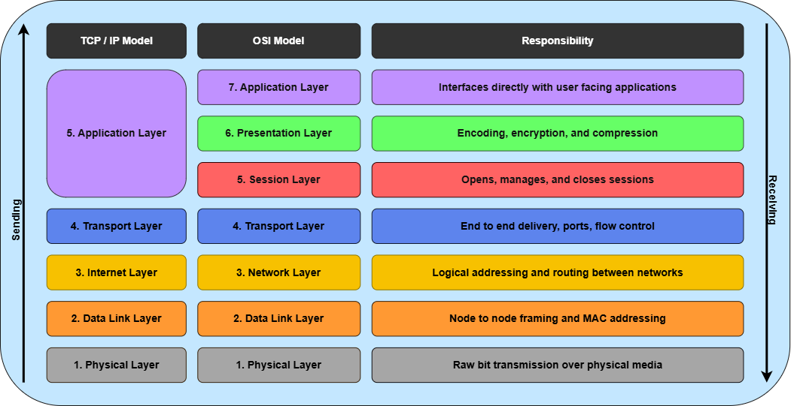

 
# OSI Model

A conceptual framework that divides network communication into seven layers, providing a standard way for different devices, applications, and networks to communicate with each other
 
## Layer 7 - Application
- Provides services to application software running on a computer
- How host programs interface with the transport layer
- Identifies communication partners, determines resource availability, synchronizes communication

| Port | Protocol | What it does |
|------|----------|--------------|
| 21 (20 active mode) | File Transfer Protocol (FTP) | Transfer files unencrypted |
| 22 | Secure Shell (SSH) | Encrypted remote access |
| 23 | Telnet | Non-encrypted remote access |
| 25 | Simple Mail Transfer Protocol (SMTP) | Send email |
| 53 | Domain Name Service (DNS) | Maps domain names to IPs |
| 67/68 | Dynamic Host Configuration Protocol (DHCP) | Dynamically assigns IP configuration (IP address, subnet mask, gateway, DNS) |
| 80 | HyperText Transfer Protocol (HTTP) | Non-encrypted web pages |
| 110 | Post Office Protocol v3 (POP3) | Retrieve email (download / delete) |
| 123 | Network Time Protocol (NTP) | Time synchronization |
| 143 | Internet Message Access Protocol (IMAP) | Retrieve email (synced, stays on server) |
| 161/162 | Simple Network Management Protocol (SNMP) | Network device management |
| 389 | Lightweight Directory Access Protocol (LDAP) | Directory services / user auth |
| 443 | HyperText Transfer Protocol Secure (HTTPS) | Encrypted web pages |
| 3389 | Remote Desktop Protocol (RDP) | Microsoft's graphical remote desktop protocol |

Well known port range: **0 - 1023** 
Registered port range: **1024 - 49151**
- Assigned by IANA

Protocol Data Unit: **Data**
 
## Layer 6 - Presentation
- Translates data between the application and the network
- Handles encoding, compression, and encryption/decryption

| Format / Protocol | What it does|
|-------------------|---------|
| TLS (formerly SSL) | Encryption in transit (used by HTTPS) |
| ASCII / Unicode | Text character encoding |
| JPEG / PNG / MPEG | Image / video compression |
| JSON / XML | Data serialization formats |
| Base64 | Binary-to-text encoding |
 
Protocol Data Unit: **Data**
 
## Layer 5 - Session
- Manages the lifecycle of a communication session
- Opens, maintains, and closes sessions between devices
- Handles authentication and reconnection after interruption

| Protocol | What it does |
|----------|---------|
| NetBIOS | Session setup for Windows networking |
| RPC | Remote Procedure Call - execute code on remote system |
| SIP | Session Initiation Protocol - sets up VoIP/video calls |
| PPTP | Point-to-Point Tunneling Protocol - older VPN |
 
Protocol Data Unit: **Data**

 
## Layer 4 - Transport

- Defines level of service and status of the connection
- Responsible for segmentation/sequencing, flow control, and error recovery
- Uses source and destination port numbers to identify applications

| Protocol | Type | Characteristic |
|----------|------|----------------|
| TCP | Connection-oriented | Higher overhead, guaranteed delivery, ordered, error-checked|
| UDP | Connectionless | Lower overhead, no guarantee, send and forget, used for voice/video |
 
Ephemeral port range: **49152 - 65535**
- Clients typically use ephemeral source ports assigned by OS
 
Protocol Data Unit: **Segment** (TCP) / **Datagram** (UDP)
 
## Layer 3 - Network
- Handles logical addressing and routing between different networks
- Routers operate here
- Determines the best path for data to travel across the internet

| Protocol | Purpose |
|----------|---------|
| IPv4 | 32-bit addressing |
| IPv6 | 128-bit addressing - replacing IPv4 |
| ICMP | Error reporting and diagnostics (ping, traceroute) |
| ARP | Maps IP addresses to MAC addresses (realistically between layer 2 and layer 3) |
| OSPF | Interior routing protocol - finds best path inside a network |
| BGP | Exterior routing protocol - routes between Autonomous Systems / backbone of the internet |
 
Protocol Data Unit: **Packet**
 
 
## Layer 2 - Data Link
- Moves frames between two directly connected nodes
- Uses MAC addresses (hardware addresses burned into NIC)
- Switches operate here

| Protocol / Standard | Purpose |
|---------------------|---------|
| Ethernet (802.3) | Wired LAN framing standard |
| Wi-Fi (802.11) | Wireless LAN framing standard |
| PPP | Point-to-Point Protocol - direct links (DSL) |
| MAC addresses | 48-bit hardware addresses assigned to a NIC (can be spoofed in software) |
| VLANs (802.1Q) | Logical network segmentation at Layer 2 |
 
Protocol Data Unit: **Frame**

 
## Layer 1 - Physical
- Raw bit transmission over physical media
- No addressing, just 0s and 1s as signals
- Hubs and repeaters operate here

| Media / Device | Type |
|----------------|------|
| Ethernet cable (Cat5e/6/6a/etc) | Copper twisted pair (UTP/STP) |
| Fiber optic | Light pulses, long distance, fast |
| Coaxial cable | Older standard, still used in cable internet |
| Radio Waves (RF) | Physical transmission medium for Wi-Fi |
| Bluetooth | Short-range wireless |
| Hub | Repeats signal to all ports; dumb switch |
| Repeater | Boosts signal over long distances |
 
Protocol Data Unit: **Bit**
 
---
 
# TCP/IP Model
 
The **practical** model: what the internet actually runs on

OSI is **theoretical**: used for teaching/troubleshooting

TCP/IP collapses 7 OSI layers into 5:

| TCP/IP Layer | Name | OSI Equivalent |
|---|---|---|
| 5 | Application | OSI 7, 6, 5 |
| 4 | Transport | OSI 4 |
| 3 | Internet | OSI 3 |
| 2 | Data Link | OSI 2 |
| 1 | Physical | OSI 1 |
 
---
 
## Layer 5 - Application
- Absorbs OSI's Application, Presentation, and Session layers into one
- Software handles encoding, encryption, and session management itself
- No strict handoff between sublayers like OSI implies
 
## Layer 4 - Transport
- TCP = reliable, ordered, connection-oriented
- UDP = fast, no guarantee: streaming, voice/video

## Layer 3 - Internet
- Maps to OSI Network layer
- IP protocol lives here, every packet gets a source and destination IP
- Routers forward packets based on IP addresses
 
## Layer 2 - Data Link
- Maps to OSI Data Link layer
- Handles node-to-node framing using MAC addresses
- Switches and NICs operate here
 
## Layer 1 - Physical
- Maps to OSI Physical layer
- Raw bit transmission: cables, signals, radio waves
- No addressing or logic
 
## References
- CCNA
- [ibm](https://www.ibm.com/think/topics/osi-model)
- [Cloudflare](https://www.cloudflare.com/learning/ddos/glossary/open-systems-interconnection-model-osi/)
- [IANA](https://www.iana.org/assignments/service-names-port-numbers/service-names-port-numbers.xhtml)