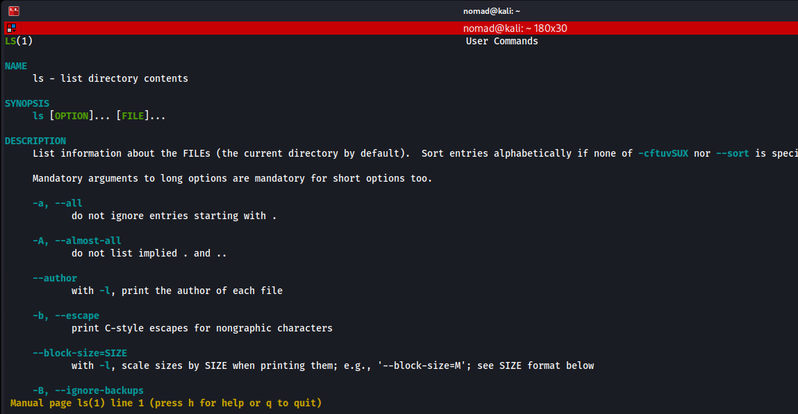
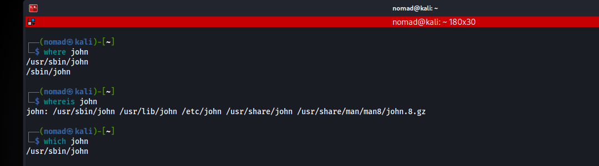
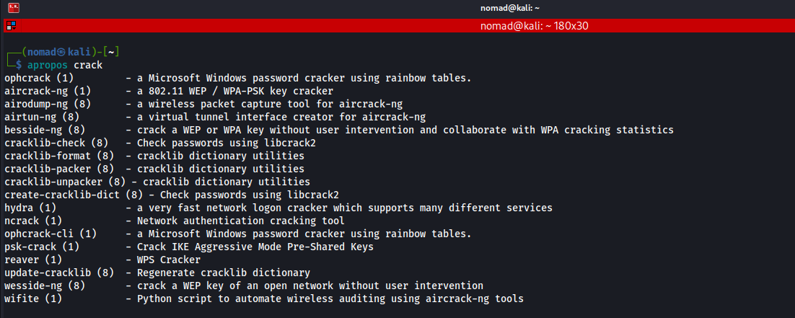
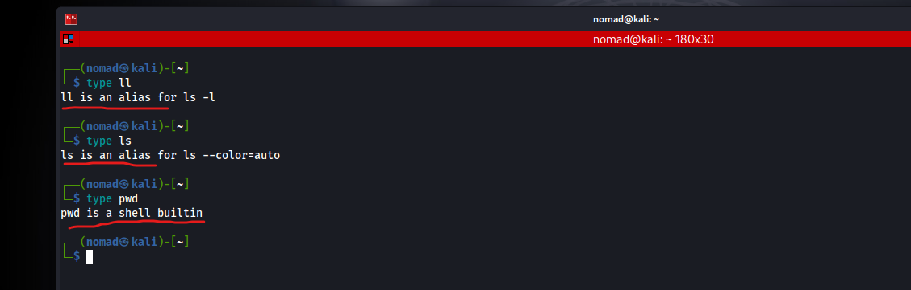

# Man Pages

Pulling this from the man pages man:

```bash
man man

DESCRIPTION
       man is the system's manual pager.  Each page argument given to man is normally the name of a program, utility or
       function.   The  manual page associated with each of these arguments is then found and displayed.  A section, if
       provided, will direct man to look only in that section of the manual.  The default action is to search in all of
       the available sections following a pre-defined order (see DEFAULTS), and to show only the first page found, even
       if page exists in several sections.
```

---

## Commands / Steps

Here are the section types and some section names:
```bash
       1   Executable programs or shell commands
       2   System calls (functions provided by the kernel)
       3   Library calls (functions within program libraries)
       4   Special files (usually found in /dev)
       5   File formats and conventions, e.g. /etc/passwd
       6   Games
       7   Miscellaneous (including macro packages and conventions), e.g. man(7), groff(7), man-pages(7)
       8   System administration commands (usually only for root)
       9   Kernel routines [Non standard]

       A manual page consists of several sections.

       Conventional section names  include  NAME,  SYNOPSIS,  CONFIGURATION,  DESCRIPTION,  OPTIONS,  EXIT STATUS,  RE‐
       TURN VALUE, ERRORS, ENVIRONMENT, FILES, VERSIONS, STANDARDS, NOTES, BUGS, EXAMPLE, AUTHORS, and SEE ALSO.
```
| Section Name | What it is-ish |
|--------|----------|
|`NAME` | Generally a name + short description |
|`SYNOPSIS` | The usage of the command |
|`DESCRIPTION` | Generally a longer description of what it does / can include arguments |
|`OPTIONS` | The flags and their meanings |
|`EXAMPLES` | Self explanatory |
|`SEE ALSO` | Similar commands/programs |
|`AUTHOR` | Who wrote the program |

- Also, each program could potentially have different/non-standard section names



---

## which / whereis

We can use `which` or `where/whereis` to find where a command is ran from/the location of the binaries themselves:
- `which` to locate where the binary is located (abs path)
- `whereis/where` to locate the binary, source, and manual page files for a command



---

## apropos

We can use `apropos` to search through the man pages for keywords in descriptions:
- Same thing as `man -k <string>`
- This could lead to similar commands, or we could look in the `SEE ALSO` section



---

## Notes / Gotchas

- We can use `type` to check if a command is an alias, builtin, or binary


