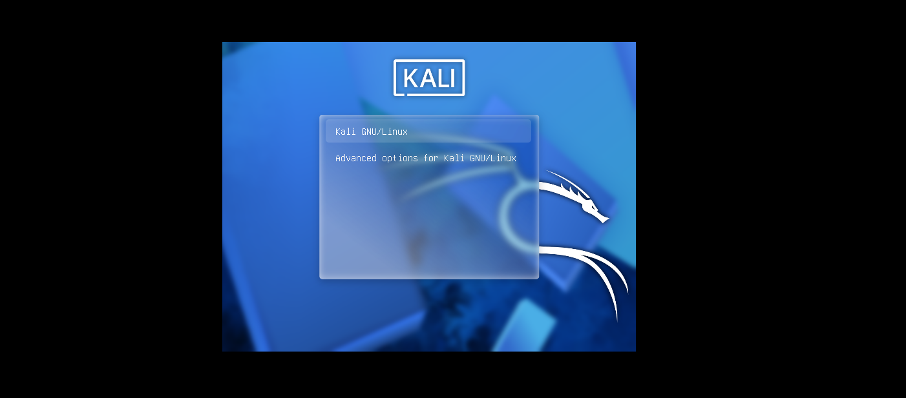
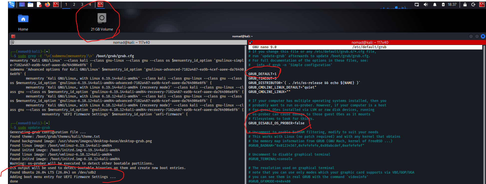

# Changing Boot Order with GRUB


## Overview

GRUB (Grand Unified Bootloader)
- Default bootloader for Linux, which is essentially software that loads the OS into RAM and runs it
- Two stages
  - Stage 1 - locate stage 2
  - Stage 2 - Kernel selection, load initrd into memory, builds framework for root filesystem

Ref:
- https://linuxvox.com/blog/ubuntu-change-boot-order/

---

## Commands / Steps


### Initial boot menu:



---

### List boot entries

```bash
└─$ sudo grep -E '\<(submenu|menuentry)\>' /boot/grub/grub.cfg
menuentry 'Kali GNU/Linux' --class kali --class gnu-linux --class gnu --class os $menuentry_id_option 'gnulinux-simple-7182a487-ea9b-4cef-aaee-da764906e8f6' {
submenu 'Advanced options for Kali GNU/Linux' $menuentry_id_option 'gnulinux-advanced-7182a487-ea9b-4cef-aaee-da764906e8f6' {
```

### Update boot entries

Modify the `/etc/default/grub` file and uncomment `GRUB_DISABLE_OS_PROBER=false`
- Unless guest OSes installed via LVM or raw disk devices

```bash
# If your computer has multiple operating systems installed, then you
# probably want to run os-prober. However, if your computer is a host
# for guest OSes installed via LVM or raw disk devices, running
# os-prober can cause damage to those guest OSes as it mounts
# filesystems to look for things.
GRUB_DISABLE_OS_PROBER=false
```

Save the file, and then run `sudo update-grub`

```bash
┌──(nomad㉿kali)-[~]
└─$ sudo update-grub           
Generating grub configuration file ...
Found theme: /boot/grub/themes/kali/theme.txt
Found background image: /usr/share/images/desktop-base/desktop-grub.png
Found linux image: /boot/vmlinuz-6.19.14+kali-amd64
Found initrd image: /boot/initrd.img-6.19.14+kali-amd64
Found linux image: /boot/vmlinuz-6.18.12+kali-amd64
Found initrd image: /boot/initrd.img-6.18.12+kali-amd64
Warning: os-prober will be executed to detect other bootable partitions.
Its output will be used to detect bootable binaries on them and create new boot entries.
Found Ubuntu 26.04 LTS (26.04) on /dev/sdb2
Adding boot menu entry for UEFI Firmware Settings ...
done
```



Notice how the output says `Found Ubuntu 26.04 LTS (26.04) on /dev/sdb2`

### List updated boot entries

```bash
└─$ sudo grep -E '\<(submenu|menuentry)\>' /boot/grub/grub.cfg
menuentry 'Kali GNU/Linux' --class kali --class gnu-linux --class gnu --class os $menuentry_id_option 'gnulinux-simple-7182a487-ea9b-4cef-aaee-da764906e8f6' {
submenu 'Advanced options for Kali GNU/Linux' $menuentry_id_option 'gnulinux-advanced-7182a487-ea9b-4cef-aaee-da764906e8f6' {

menuentry 'Ubuntu 26.04 LTS (26.04) (on /dev/sdb2)' --class ubuntu --class gnu-linux --class gnu --class os $menuentry_id_option 'osprober-gnulinux-simple-27b18ed0-deda-45bd-8fe6-5d8f9b5cde83' {
submenu 'Advanced options for Ubuntu 26.04 LTS (26.04) (on /dev/sdb2)' $menuentry_id_option 'osprober-gnulinux-advanced-27b18ed0-deda-45bd-8fe6-5d8f9b5cde83' {
```

### Edit boot order

From here, we can also edit `/etc/default/grub` and change the `GRUB_DEFAULT` variable to match whichever entry we want to default boot into

```bash
# for example:
GRUB_DEFAULT=2
```

Dont forget to `sudo update-grub`

---


---

## Notes / Gotchas

- Best practice is to save a backup of `/boot/grub/grub.cfg` before any changes are made
- After updating `/etc/default/grub`, run `sudo update-grub` for changes to take effect
- If you wanted to reboot straight into another option, use `grub-reboot 2` or whatever number
  - This doesn't permanantly change the default, just the default for the next `reboot` only