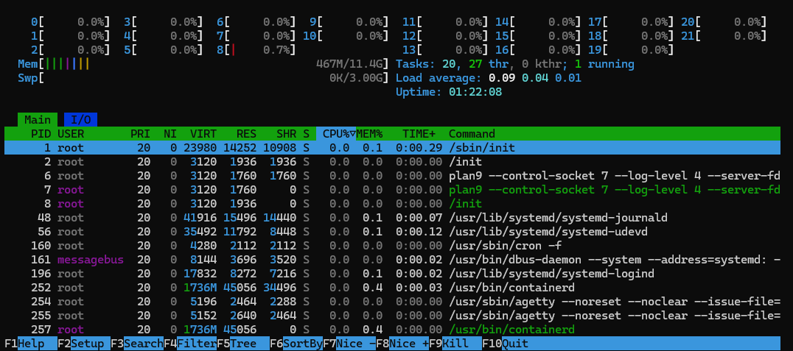

# Viewing System Resources

## Overview (man)

`ps` - report a snapshot of the current processes

```
DESCRIPTION
       ps displays information about a selection of the active processes.  If you want a repetitive update of the selection and the
       displayed information, use top instead.
```

`top` - display Linux processes

```
DESCRIPTION
       The  top  program  provides  a dynamic real-time view of a running system.  It can display system summary information as well as a
       list of processes or threads currently being managed by the Linux kernel.
```

`htop` - cross-platform ncurses-based process viewer

```
DESCRIPTION
       It is similar to top, but allows you to scroll vertically and horizontally, and interact using a pointing device (mouse).
```

`kill` - send a signal to a process

```
DESCRIPTION
       The default signal for kill is TERM.  Use -l or -L to list available signals.  Particularly useful signals include HUP, INT, KILL,
       STOP,  CONT,  and 0.  Alternate signals may be specified in three ways: -9, -SIGKILL or -KILL.  Negative PID values may be used to
       choose whole process groups
```

---

## Commands / Steps

### ps
```bash
┌──(nomad㉿nomad)-[~]
└─$ ps auxef
USER         PID %CPU %MEM    VSZ   RSS TTY      STAT START   TIME COMMAND
root           1  0.0  0.1  24548 14420 ?        Ss   19:22   0:01 /sbin/init
root           2  0.0  0.0   3120  1936 ?        Sl   19:22   0:00 /init
root           6  0.0  0.0   3120  1760 ?        Sl   19:22   0:00  \_ plan9 --control-socket 7 --log-level 4 --server-fd 8 --pipe-fd 10 -
root         502  0.0  0.0   3136   704 ?        Ss   19:22   0:00  \_ /init
root         503  0.0  0.0   3136  1056 ?        S    19:22   0:00  |   \_ /init
nomad        504  0.0  0.0   9108  5808 pts/0    Ss   19:22   0:00  |       \_ -bash HOSTTYPE=x86_64 LANG=en_US.UTF-8 PATH=/usr/local/sbin
nomad       3286  0.0  0.0   9368  4048 pts/0    R+   20:34   0:00  |           \_ ps auxef SHELL=/bin/bash WSL2_GUI_APPS_ENABLED=1 CONDA_
root         505  0.0  0.0   7944  4576 ?        Ss   19:22   0:00  \_ login -- nomad
nomad        546  0.0  0.0   5444  4752 pts/1    Ss+  19:22   0:00      \_ -bash TERM=dumb HOME=/home/nomad USER=nomad SHELL=/bin/bash PAT
root          48  0.0  0.1  50120 15664 ?        Ss   19:22   0:00 /usr/lib/systemd/systemd-journald
root          57  0.0  0.0  35492 11616 ?        Ss   19:22   0:00 /usr/lib/systemd/systemd-udevd
root          88  0.0  0.0   4280  2464 ?        Ss   19:22   0:00 /usr/sbin/cron -f
message+      93  0.0  0.0   8144  4224 ?        Ss   19:22   0:00 /usr/bin/dbus-daemon --system --address=systemd: --nofork --nopidfile -
root         115  0.0  0.0  17836  8096 ?        Ss   19:22   0:00 /usr/lib/systemd/systemd-logind
root         247  0.0  0.3 1933836 45232 ?       Ssl  19:22   0:04 /usr/bin/containerd
root         251  0.0  0.0   5196  2640 hvc0     Ss+  19:22   0:00 /usr/sbin/agetty --noreset --noclear --issue-file=/etc/issue:/etc/issue
root         252  0.0  0.0   5152  2640 tty1     Ss+  19:22   0:00 /usr/sbin/agetty --noreset --noclear --issue-file=/etc/issue:/etc/issue
root         270  0.0  0.6 1901840 77032 ?       Ssl  19:22   0:00 /usr/sbin/dockerd -H fd:// --containerd=/run/containerd/containerd.sock
nomad        515  0.0  0.1  22324 12496 ?        Ss   19:22   0:00 /usr/lib/systemd/systemd --user
nomad        517  0.0  0.0  22620  3792 ?        S    19:22   0:00  \_ (sd-pam)
polkitd     1281  0.0  0.0 380476  7920 ?        Ssl  19:49   0:00 /usr/lib/polkit-1/polkitd --no-debug --log-level=notice
```

|Flag|What it displays|
|----|----|
|`a`| All with tty, including other users |
|`u`| User-oriented format |
|`x`| Processes not attached to the terminal |
|`e`| Show the environment after command |
|`f`| Ascii art process tree |
|`-f`| Displays PPID |
|`-u user`| Displays specific user processes (or current user if none specified) |

---

### top
```bash
top - 20:35:33 up  1:12,  1 user,  load average: 0.00, 0.00, 0.00
Tasks:  21 total,   1 running,  20 sleeping,   0 stopped,   0 zombie
%Cpu(s):  0.0 us,  0.0 sy,  0.0 ni,100.0 id,  0.0 wa,  0.0 hi,  0.0 si,  0.0 st
MiB Mem :  11672.7 total,  10402.5 free,    649.7 used,    833.3 buff/cache
MiB Swap:   3072.0 total,   3072.0 free,      0.0 used.  11023.0 avail Mem

    PID USER      PR  NI    VIRT    RES    SHR S  %CPU  %MEM     TIME+ COMMAND
    247 root      20   0 1933836  45232  34672 S   0.7   0.4   0:04.20 containerd
      1 root      20   0   24548  14420  10900 S   0.0   0.1   0:01.38 systemd
      2 root      20   0    3120   1936   1936 S   0.0   0.0   0:00.00 init-systemd(ka
      6 root      20   0    3120   1760   1760 S   0.0   0.0   0:00.00 init
     48 root      20   0   50120  15664  14608 S   0.0   0.1   0:00.13 systemd-journal
     57 root      20   0   35492  11616   8448 S   0.0   0.1   0:00.13 systemd-udevd
     88 root      20   0    4280   2464   2288 S   0.0   0.0   0:00.01 cron
     93 message+  20   0    8144   4224   3696 S   0.0   0.0   0:00.22 dbus-daemon
    115 root      20   0   17836   8096   7040 S   0.0   0.1   0:00.09 systemd-logind
    251 root      20   0    5196   2640   2464 S   0.0   0.0   0:00.00 agetty
    252 root      20   0    5152   2640   2464 S   0.0   0.0   0:00.00 agetty
    270 root      20   0 1901840  77032  55968 S   0.0   0.6   0:00.81 dockerd
    502 root      20   0    3136    704    704 S   0.0   0.0   0:00.00 SessionLeader
    503 root      20   0    3136   1056   1056 S   0.0   0.0   0:00.39 Relay(504)
    504 nomad     20   0    9108   5808   3696 S   0.0   0.0   0:00.59 bash
    505 root      20   0    7944   4576   4048 S   0.0   0.0   0:00.00 login
    515 nomad     20   0   22324  12496  10208 S   0.0   0.1   0:00.05 systemd
    517 nomad     20   0   22620   3792   2112 S   0.0   0.0   0:00.00 (sd-pam)
    546 nomad     20   0    5444   4752   3168 S   0.0   0.0   0:00.01 bash
   1281 polkitd   20   0  380476   7920   7040 S   0.0   0.1   0:00.13 polkitd
   3310 nomad     20   0   10420   5632   3520 R   0.0   0.0   0:00.00 top
```

---

### htop



---

### kill
```bash
┌──(nomad㉿nomad)-[~]
└─$ sudo kill -L
 1 HUP      2 INT      3 QUIT     4 ILL      5 TRAP     6 ABRT     7 BUS
 8 FPE      9 KILL    10 USR1    11 SEGV    12 USR2    13 PIPE    14 ALRM
15 TERM    16 STKFLT  17 CHLD    18 CONT    19 STOP    20 TSTP    21 TTIN
22 TTOU    23 URG     24 XCPU    25 XFSZ    26 VTALRM  27 PROF    28 WINCH
29 POLL    30 PWR     31 SYS

┌──(nomad㉿nomad)-[~]
└─$ ps -fu nomad
UID          PID    PPID  C STIME TTY          TIME CMD
nomad        504     503  0 19:22 pts/0    00:00:00 -bash
nomad        515       1  0 19:22 ?        00:00:00 /usr/lib/systemd/systemd --user
nomad        517     515  0 19:22 ?        00:00:00 (sd-pam)
nomad        546     505  0 19:22 pts/1    00:00:00 -bash
nomad       3414     503 14 20:35 pts/0    00:00:37 /usr/lib/jvm/java-21-openjdk-amd64/bin/java -Djava.system.class.loader=ghidra.GhidraClassLoader -Dfile.encoding=UTF8 -Duser.country=US -Duser.language=en -Du
nomad       4268    3414  0 20:40 pts/0    00:00:00 /usr/share/ghidra/Ghidra/Features/Decompiler/os/linux_x86_64/decompile
nomad       4305     504  0 20:40 pts/0    00:00:00 ps -fu nomad

┌──(nomad㉿nomad)-[~]
└─$ sudo kill -9 3414

┌──(nomad㉿nomad)-[~]
└─$ ps -fu nomad
UID          PID    PPID  C STIME TTY          TIME CMD
nomad        504     503  0 19:22 pts/0    00:00:00 -bash
nomad        515       1  0 19:22 ?        00:00:00 /usr/lib/systemd/systemd --user
nomad        517     515  0 19:22 ?        00:00:00 (sd-pam)
nomad        546     505  0 19:22 pts/1    00:00:00 -bash
nomad       4328     504  0 20:40 pts/0    00:00:00 ps -fu nomad
```

| Signal | Name | Description |
|---|---|---|
| 1 | HUP | Hangup; used to reload a service config without restarting |
| 2 | INT | Interrupt; same as `ctrl+c`, asks process to stop |
| 9 | KILL | Forceful termination; cannot be caught or ignored |
| 11 | SEGV | Segmentation fault; process accessed invalid memory |
| 15 | TERM | Graceful shutdown request; can be caught (default `kill` signal) |
| 18 | CONT | Resume a stopped process |
| 19 | STOP | Pause a process; cannot be caught or ignored |
| 20 | TSTP | Terminal stop; same as `ctrl+z`, suspends last fg process |

---

## Notes / Gotchas

HTOP / TOP is essentially the Windows Task Manager for Linux

Ref:
- https://linuxbash.sh/post/managing-processes-with-ps-top-htop-and-kill
