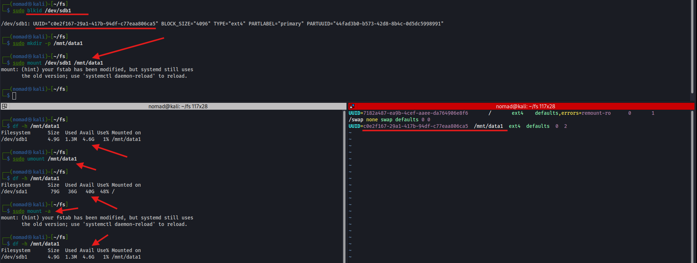

# /etc/fstab

## Overview

`/etc/fstab` is how we define filesystems that are to be automatically mounted at boot
- Each line maps a device to a mount point with filesystem type and mount options
- Used for persistent mounts of local disks, network shares, or other filesystems

---

## fstab Format

```
<device>  <mountpoint>  <fstype>  <options>  <dump>  <pass>
```

| Field | Description |
|---|---|
| `device` | UUID, device path, or label |
| `mountpoint` | Where to mount (`/mnt/data1`) |
| `fstype` | Filesystem type (`ext4`, `nfs`, `vfat`) |
| `options` | Mount options (`defaults`, `ro`, `noauto`) |
| `dump` | Backup flag - `0`=skip, `1`=include |
| `pass` | fsck order - `0`=skip, `1`=root, `2`=others |

---

## Commands / Steps

```bash
# Get UUID of partition
┌──(nomad㉿kali)-[~/fs]
└─$ sudo blkid /dev/sdb1

/dev/sdb1: UUID="c0e2f167-29a1-417b-94df-c77eaa806ca5" BLOCK_SIZE="4096" TYPE="ext4" PARTLABEL="primary" PARTUUID="44fad3b0-b573-42d8-8b4c-0d5dc5998991"

# Create mount point
sudo mkdir -p /mnt/data1

# Mount temporarily to test first
sudo mount /dev/sdb1 /mnt/data1
df -h /mnt/data1

# Add to fstab
sudo vim /etc/fstab
```

Add line (match the UUID):
```
UUID=c0e2f167-29a1-417b-94df-c77eaa806ca5  /mnt/data1  ext4  defaults  0  2
```

```bash
# Unmount and test fstab entry (instead of reboot)
sudo umount /mnt/data1
sudo mount -a

# Verify
df -h /mnt/data1
```

---

## Common Mount Options

| Option | Description |
|---|---|
| `defaults` | rw, suid, dev, exec, auto, nouser, async |
| `ro` | Read only |
| `noauto` | Don't mount at boot, manual only |
| `user` | Allow non-root users to mount |
| `nofail` | Don't fail boot if device missing |
| `_netdev` | Wait for network before mounting (NFS/SMB) |

---

## Screenshots



---

## Notes / Gotchas
- **Use UUID instead of `/dev/sdbX`** - device names can change between reboots if disks are added/removed
- Test with `sudo mount -a` before rebooting - a bad fstab entry can prevent the system from booting
- Add `nofail` option for non-critical mounts so a missing device doesn't halt boot
- `dump` field is mostly ignored by modern systems - just use `0`
- `pass` field: root filesystem should be `1`, everything else `2` or `0`
- Reload systemd after editing fstab: `sudo systemctl daemon-reload`
- Click here for remote mounting: [mount remote drive](remote-drive-mount.md)