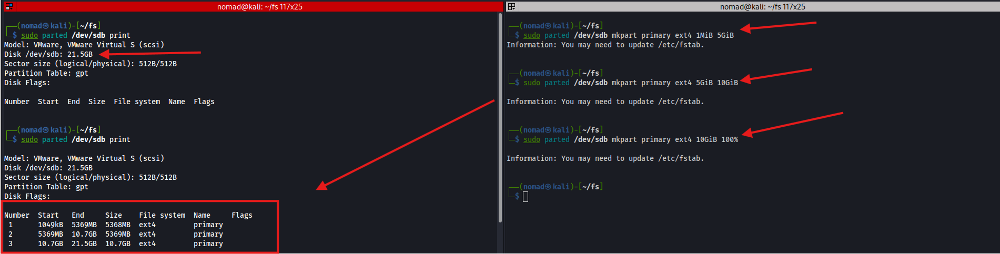
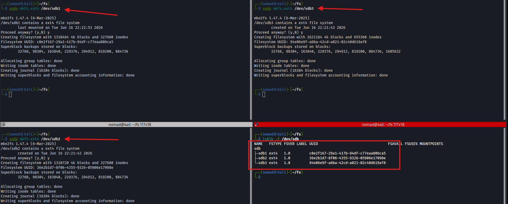
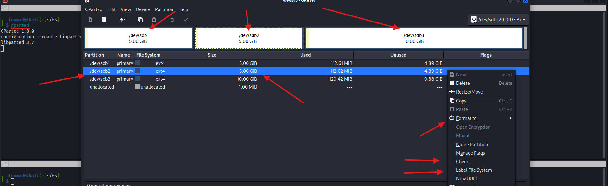

# parted / gparted

## Overview

`parted` is a CLI tool for creating, resizing, and managing disk partitions, `gparted` is the GUI equivalent
- Use when setting up a new disk, resizing partitions, or changing partition tables
- Unlike `fdisk`, parted supports GPT partition tables and disks larger than 2TB

**When to use:**
- `parted` - scripting, headless servers, CLI preference
- `gparted` - visual layout, resizing with a safety net, desktop environments

---

## Commands / Steps

```bash
# View current partition layout
sudo parted /dev/sdb print

# Launch interactive mode
sudo parted /dev/sdb

# Create a new GPT partition table (wipes existing partitions)
sudo parted /dev/sdb mklabel gpt

# Create partitions (demo three):

# from 1MB to 5GB
sudo parted /dev/sdb mkpart primary ext4 1MiB 5GiB

# from 5GB to 10GB
sudo parted /dev/sdb mkpart primary ext4 5GiB 10GiB 

# from 10GB to the remaining (100%)
sudo parted /dev/sdb mkpart primary ext4 10GiB 100% 

# Verify
sudo parted /dev/sdb print
```



```bash
# Format partitions after creating them
sudo mkfs.ext4 /dev/sdb1
sudo mkfs.ext4 /dev/sdb2
sudo mkfs.ext4 /dev/sdb3

# Verify filesystems
lsblk -f /dev/sdb
```

**Verify:**
```
┌──(nomad㉿kali)-[~/fs]
└─$ sudo parted /dev/sdb print
Model: VMware, VMware Virtual S (scsi)
Disk /dev/sdb: 21.5GB
Sector size (logical/physical): 512B/512B
Partition Table: gpt
Disk Flags: 

Number  Start   End     Size    File system  Name     Flags
 1      1049kB  5369MB  5368MB  ext4         primary
 2      5369MB  10.7GB  5369MB  ext4         primary
 3      10.7GB  21.5GB  10.7GB  ext4         primary


┌──(nomad㉿kali)-[~/fs]
└─$ lsblk -f /dev/sdb

NAME   FSTYPE FSVER LABEL UUID                                 FSAVAIL FSUSE% MOUNTPOINTS
sdb                                                                           
├─sdb1 ext4   1.0         c0e2f167-29a1-417b-94df-c77eaa806ca5                
├─sdb2 ext4   1.0         36e2b1d7-8f06-4355-9326-05906e17098e                
└─sdb3 ext4   1.0         94e06e9f-a6ba-42cd-a021-02c40d619af8                
```



| Command | Description |
|---|---|
| `mklabel gpt` | Create new GPT partition table |
| `mklabel msdos` | Create new MBR partition table |
| `mkpart` | Create a new partition |
| `rm N` | Delete partition number N |
| `resizepart` | Resize a partition |
| `print` | Show partition layout |

---

## gparted

```bash
# Install if not already
sudo apt install gparted

# Launch
sudo gparted
```

gparted provides the same functionality as parted but gui version. Useful for resizing partitions safely since it shows exactly what will change before applying



---

## Notes / Gotchas
- `mklabel` wipes all existing partitions with no confirmation prompt
- Always use `1MiB` as the start of the first partition for alignment
- `100%` as the end value uses all the remaining space
- parted works in MB/GB by default; use `MiB/GiB` for exact binary sizes
- After creating partitions you have to format them with `mkfs` before use
- GPT supports up to 128 partitions, MBR supports only 4 primary
