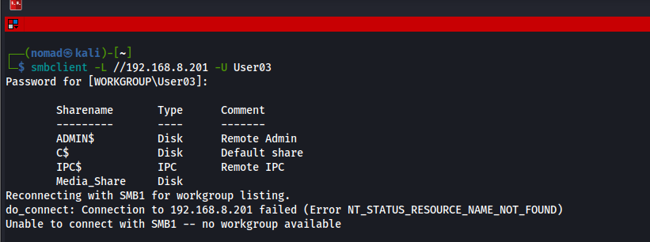
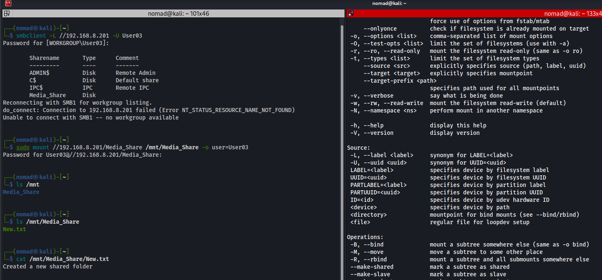

# Mounting a Remote Windows Drive on Linux

Windows shares folders using SMB (port 445). Linux can mount SMB shares using the `cifs-utils` package (NFS natively)
- `sudo apt install cifs-utils`

## Commands / Steps

First use `smbclient -L` to list the shares from a Windows machine using SMB:

```bash
smbclient -L //192.168.8.201 -U User03
```

Then create a mount point and mount the shared folder:

```bash
sudo mkdir -p /mnt/Media_Share
sudo mount //192.168.8.201/Media_Share /mnt/Media_Share -o user=User03
```

- Using `-o user=User03` to specify using the `username` option

Then verify shared folder contents:

```bash
ls /mnt/Media_Share
cat /mnt/Media_Share/New.txt
```

---

Can also make this persistent by adding an entry in `/etc/fstab`:

```bash
#Add password
//192.168.8.201/Media_Share  /mnt/Media_Share  cifs  username=User03,password=PASSWORD,_netdev  0  0
```

Ref:
- https://linuxvox.com/blog/mount-smb-share-on-linux/

## fstab is world readable

Use a credentials file so the password isnt in plaintext in fstab:
```bash
# Create credentials file
sudo vim /etc/samba/credentials
```

```bash
username=User03
password=<password>
```

```bash
# lock down
sudo chmod 600 /etc/samba/credentials
sudo chown root:root /etc/samba/credentials
```

Then in fstab instead of username=User03,password=PASSWORD:
```bash
//192.168.8.201/Media_Share  /mnt/Media_Share  cifs  credentials=/etc/samba/credentials,_netdev  0  0
```

Anyone who can read fstab (/etc/fstab is world-readable by default) can see plaintext passwords, but now the credentials file is only readable by root


## Screenshots




---

## Notes / Gotchas

- Click here for fstab notes: [fstab](fstab.md)