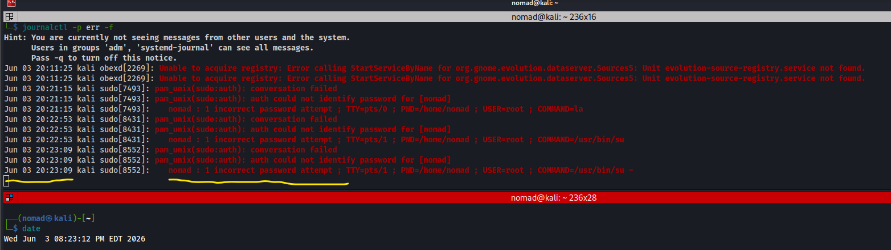
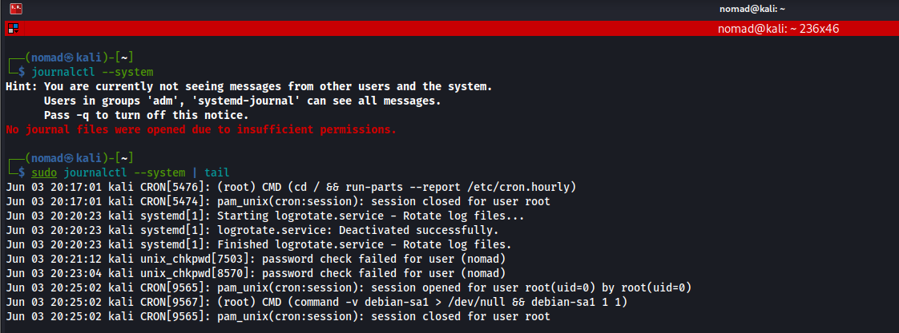
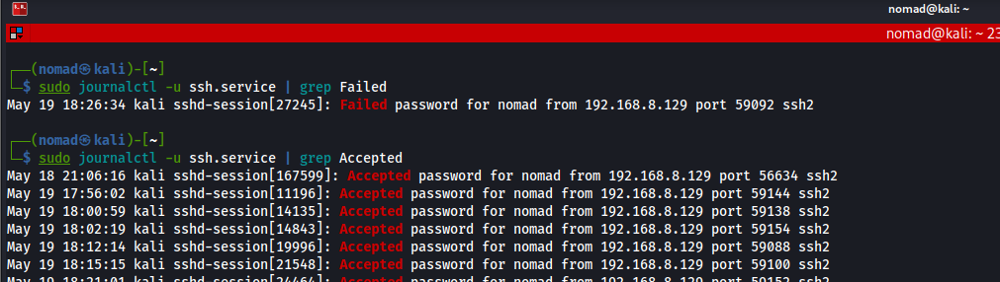

# Viewing Logs with journalctl

## Overview

```bash
NAME
     journalctl - Print log entries from the systemd journal
     
DESCRIPTION
     journalctl is used to print the log entries stored in the journal by systemd-journald.service(8) and systemd-journal-remote.service(8).
     
     If called without parameters, it will show the contents of the journal accessible to the calling user, starting with the oldest entry collected.
     
SOURCE OPTIONS
     The following options control where to read journal records from:

     --system, --user
         Show messages from system services and the kernel (with --system). Show messages from service of current user (with --user). If neither is specified, show all messages that the user can see.
```

This is a tool to query the `systemd journal`, which is essentially a repo for logs that is managed by `systemd-journald`

---

## Commands / Steps

```bash
# Show contents of journal current user has permissions for
journalctl 

# All errors and above (error, critical, alert, emergency)
journalctl -p err

# This boot only
sudo journalctl -b

# Previous boot only
sudo journalctl -b -1

# Specific service
journalctl -u ssh.service

# Follow live errors (like tail -f)
journalctl -p err -f

# System messages
sudo journalctl --system

# Since an hour ago
journalctl --since "1 hour ago"
```
---

## Screenshots

Following live errors:


System messages:


SSH service logs:


---

## Notes / Gotchas

- Can use `-g` flag for grep
