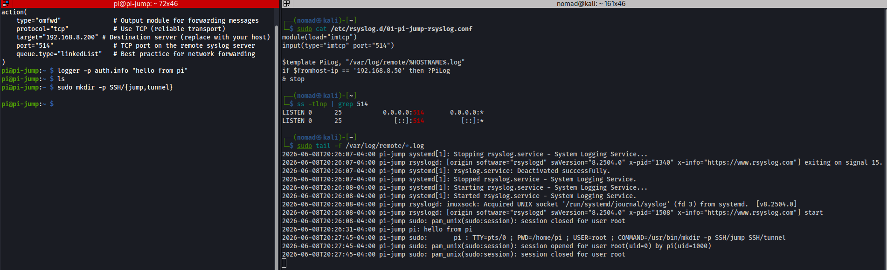

# Remote Logging with rsyslog


## Overview

Ref:
- https://docs.rsyslog.com/doc/getting_started

---

## Setup rsyslog server

Create `01-pi-jump-rsyslog.conf` under `/etc/rsyslog.d/`:
- Default port is 514 for rsyslog

```bash
sudo tee /etc/rsyslog.d/01-pi-jump-rsyslog.conf << 'EOF'
module(load="imtcp")
input(type="imtcp" port="514")
$template PiLog, "/var/log/remote/%HOSTNAME%.log"
if $fromhost-ip == '192.168.8.50' then ?PiLog
& stop
EOF
```

Restart `rsyslog`:

```bash
sudo systemctl restart rsyslog
```

Verify the port is open:
```bash
ss -tlnp | grep 514
```

---

## Setup rsyslog client

Create `01-kali-rsyslog.conf` under `/etc/rsyslog.d/`:

```bash
sudo tee /etc/rsyslog.d/01-kali-rsyslog.conf << 'EOF'
action(
    type="omfwd"              # Output module for forwarding messages
    protocol="tcp"            # Use TCP (reliable transport)
    target="192.168.8.200"    # Destination server (replace with your host)
    port="514"                # TCP port on the remote syslog server
    queue.type="linkedList"   # Best practice for network forwarding
)
EOF
```

Restart `rsyslog`:

```bash
sudo systemctl restart rsyslog
```

---

## Verify

Back on the server, we can follow the newly created log file once it gets created:

```bash
sudo tail -f /var/log/remote/*.log
```

---

## Screenshots



---

## Notes / Gotchas

- Files under `/etc/rsyslog.d/` are loaded from `$IncludeConfig` in rsyslog.conf (avoids conflicts with distro updates)
- `& stop` prevents matched pi logs from also landing in the server's own /var/log/syslog
- Can test with from the client with `logger -p auth.info "hello from pi"` then check `sudo tail -f /var/log/remote/*.log` on the server