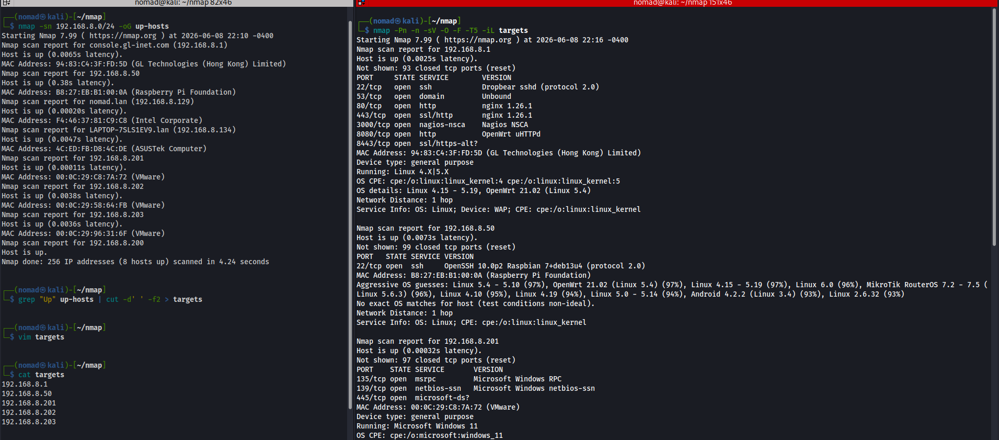
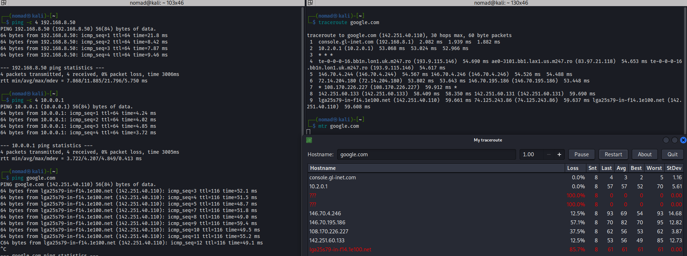

# Testing Connectivity to a Remote Host

## ping
Sends ICMP echo requests to a host and reports round trip time and packet loss
- `-c` limits the number of packets sent (or its just continuous)

```bash
# Test reachability to Pi (same subnet over WiFi)
ping -c 4 192.168.8.50

# Test reachability across WireGuard tunnel to Ubuntu
ping -c 4 10.0.0.1

# Continuous ping to external host
ping google.com
```

**Lab results:**
- Pi (192.168.8.50): ~11ms avg, TTL=64, same subnet, WiFi
- WireGuard (10.0.0.1): ~4ms avg, TTL=64, VPN endpoint reachable with lower latency than the WiFi-connected Pi
- google.com: ~54ms avg, TTL 116, GLiNet tether

## traceroute
Maps every router hop between source and destination. Sends packets with incrementing TTL values, each hop that drops the TTL to 0 generates a response, revealing that hop

```bash
traceroute google.com
```

**Output:**
- Each numbered line is one hop
- Three time values = three probe packets sent per hop
- `* * *` = hop did not respond to the probe packets (common on ISP and backbone routers)

**Lab results:**
- Hop 1: `192.168.8.1` - glinet router (default gateway)
- Hop 2: `10.2.0.1` - openvpn tunnel endpoint (Debian), suggests traffic is being routed through the VPN before reaching the Internet (need to verify?)
- Hop 3: `* * *` - no response from hop (filtering or rate limiting)
- Hops 4-9: ISP backbone, destination

## mtr
Combines ping and traceroute into a live update view. Shows per-hop packet loss and latency stats in real time

```bash
# interactive
mtr google.com

# non-interactive, prints report
mtr --report 192.168.8.202
```

## nmap
Network scanner. Can discover hosts, enumerate open ports, identify services and versions, and fingerprint operating systems (and more)

```bash
# Simple host enumeration; who's alive on the subnet (no port scan)
nmap -sn 192.168.8.0/24

# Skip host discovery and DNS resolution, detect versions and OS, top 100 ports, fast, from list 'targets'
nmap -Pn -n -sV -O -F -T5 -iL targets
```

|Flag|Description|
|----|----|
|`-sn`|Host discovery only (no port scan). On local Ethernet networks Nmap typically uses ARP|
|`-sV`|Detect service versions|
|`-O`|OS fingerprinting|
|`-Pn`|Skip host discovery, assume host is up|
|`-n`|No DNS resolution (faster)|
|`-F`|Fast mode, top 100 ports only|
|`-T5`|Fastest timing template, reduces delays and retries, (may miss results)|
|`-oG`|Greppable output format|
|`-iL`|Read targets from file|
|`-sC`|Run pre-configured NSE scripts|

**Lab results:**

#### Router (192.168.8.1):
- 22/tcp SSH -- Dropbear sshd  
- 53/tcp DNS -- Unbound  
- 80/tcp HTTP -- nginx 1.26.1  
- 443/tcp HTTPS -- nginx 1.26.1  
- 3000/tcp NSCA -- Nagios NSCA  
- 8080/tcp HTTP -- OpenWrt uHTTPd  
- 8443/tcp HTTPS-alt -- SSL/TLS web service (unidentified)
---
#### Pi (192.168.8.50):
- 22/tcp SSH -- OpenSSH 10.0p2 (Raspbian)
---
#### Windows VM (192.168.8.201):
- 135/tcp msrpc -- Microsoft RPC
- 139/tcp netbios-ssn -- NetBIOS SSN
- 445/tcp microsoft-ds -- SMB
---
#### Ubuntu VM (192.168.8.202):
- 22/tcp SSH -- OpenSSH 10.2p1 (Ubuntu)
- 3389/tcp ms-wbt-server -- Microsoft Terminal Services (RDP)
---
#### Debian VM (192.168.8.203):
- 22/tcp SSH -- OpenSSH 10.0p2 (Debian)
- 80/tcp HTTP -- Apache httpd 2.4.67 (Debian)

## netcat (nc)
Low-level TCP/UDP tool. Used for port checking, banner grabbing, file transfer, and as a network pipe (reverse shell)

```bash
# Test if SSH port is open on pi
nc -zv 192.168.8.50 22

# Test Ubuntu SSH port
nc -zv 192.168.8.202 22
```

|Flag|Description|
|----|----|
|`-z`|Zero I/O mode; just check if port is open but don't send data|
|`-v`|Verbose output|

**Output:**
- `open` - TCP connection succeeded, port is accepting connections
- `inverse host lookup failed` - no reverse DNS for that IP
- `Connection refused` - typically indicates the host is reachable but the port is closed

## Screenshots





## Notes / Gotchas

- Nmap host discovery (-sn) on a local subnet typically uses ARP, not ICMP
- Firewalls may block ping while still allowing TCP connections
- traceroute and mtr might show ``* * *`` but may still be reachable
- Service/version and OS detection (-sV/O) significantly increases scan time
- Ping success does not guarantee that application ports are reachable