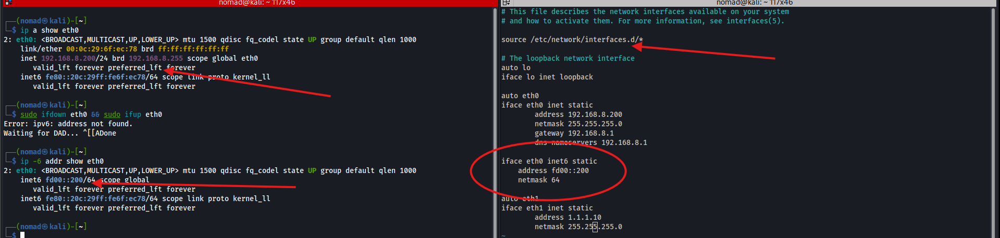
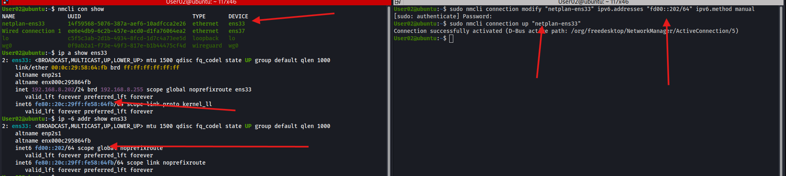
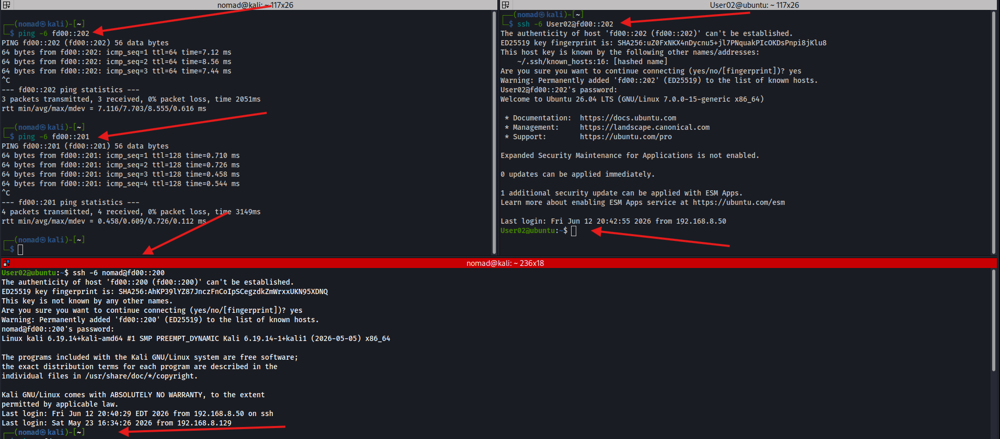

# Interface Configuration

## Overview

Linux interface configuration varies by distro/renderer. This lab uses `/etc/network/interfaces` on Kali, `netplan` on Ubuntu, and `nmcli` with NetworkManager on Debian

Always check interface names with `ip a` before editing any config file

---

## /etc/network/interfaces - Kali

Edit `/etc/network/interfaces` directly to configure static IP addresses

```bash
sudo vim /etc/network/interfaces
```

```
source /etc/network/interfaces.d/*

auto lo
iface lo inet loopback

auto eth0
iface eth0 inet static
    address 192.168.8.200
    netmask 255.255.255.0
    gateway 192.168.8.1
    dns-nameservers 192.168.8.1

auto eth1
iface eth1 inet static
    address 1.1.1.10
    netmask 255.255.255.0
```

```bash
# Apply and verify
sudo systemctl restart networking
ping 192.168.8.1
```

### IPv6 (Added post IPv4 config)
Add to `/etc/network/interfaces` under the eth0 block:
```
iface eth0 inet6 static
    address fd00::200
    netmask 64
```
```bash
sudo ifdown eth0 && sudo ifup eth0
# ipv6 address not found during ifdown since none was configured previously

ip -6 addr show eth0
# inet6 fd00::200/64 scope global
```



| Command | Description |
|---------|-------------|
| `ip a` | Show current interface names and addresses |
| `sudo vim /etc/network/interfaces` | Edit static interface config |
| `sudo systemctl restart networking` | Apply changes |

---

## netplan - Ubuntu

Used on Ubuntu. Config lives in `/etc/netplan/`. File must be valid YAML, similar to python, whitespace matters

```bash
sudo vim /etc/netplan/02-interfaces.yaml
```

```yaml
network:
  version: 2
  renderer: NetworkManager
  ethernets:
    ens33:
      dhcp4: false
      addresses:
        - 192.168.8.202/24
      routes:
        - to: default
          via: 192.168.8.1
      nameservers:
        addresses:
          - 192.168.8.1
    ens37:
      dhcp4: false
      addresses:
        - 2.2.2.30/24
```

```bash
# Apply and verify
sudo netplan apply
ping 192.168.8.200
```

Since NetworkManager is the renderer, interfaces can also be managed with nmcli after the netplan config:

```bash
sudo nmcli con mod "Wired connection 1" ipv4.addresses 2.2.2.30/24 ipv4.method manual
sudo nmcli con up "Wired connection 1"
```

### IPv6 (Added post IPv4 config)
```bash
sudo nmcli connection modify "netplan-ens33" ipv6.addresses "fd00::202/64" ipv6.method manual
sudo nmcli connection up "netplan-ens33"

ip -6 addr show ens33
# inet6 fd00::202/64 scope global
```


| Command | Description |
|---------|-------------|
| `sudo netplan apply` | Apply netplan config |
| `sudo nmcli con mod` | Modify a connection's settings |
| `sudo nmcli con up` | Bring a connection up |

---

## nmcli - Debian

Used on Debian with NetworkManager. NetworkManager stores the connection profiles, so configuration can be done through nmcli:

```bash
# Grab NIC MAC addresses to persist static configs
ip a 
ens33: <BROADCAST,MULTICAST,UP,LOWER_UP> mtu 1500 qdisc fq_codel state UP group default qlen 1000
    link/ether "00:0c:29:96:31:6f" brd ff:ff:ff:ff:ff:ff
ens37: <BROADCAST,MULTICAST,UP,LOWER_UP> mtu 1500 qdisc fq_codel state UP group default qlen 1000
    link/ether "00:0c:29:96:31:79" brd ff:ff:ff:ff:ff:ff
    
# Check existing connections
nmcli con show
    
# Configure both interfaces (also with static MAC)
sudo nmcli con mod "Wired connection 1" ipv4.addresses 192.168.8.203/24 ipv4.gateway 192.168.8.1 ipv4.dns 192.168.8.1 ipv4.method manual connection.interface-name ens33 802-3-ethernet.mac-address 00:0C:29:96:31:6F
    
sudo nmcli con mod "ens37" ipv4.addresses 2.2.2.40/24 ipv4.method manual connection.interface-name ens37 802-3-ethernet.mac-address 00:0C:29:96:31:79

# Bring them up
sudo nmcli con up "Wired connection 1"
sudo nmcli con up "ens37"

# Verify
ping 192.168.8.202
```

| Command | Description |
|---------|-------------|
| `nmcli con show` | List all connections and their states |
| `nmcli con mod` | Modify a connection property |
| `nmcli con up` | Activate a connection |

---

## IPv6 Connectivity Test
```bash
# Ping between VMs (from kali to Ubuntu and win11)
ping -6 fd00::202
ping -6 fd00::201

# SSH over IPv6
ssh -6 User02@fd00::202
```



---

## Notes / Gotchas

- Interface names (`eth0`, `ens33`, etc.) aren't the same on every machine, always run `ip a` first
- Netplan is strict about YAML whitespace
- Systems using `ifupdown` usually have interfaces unmanaged by NetworkManager, so nmcli may not affect them
- Ubuntu uses `renderer: NetworkManager` in netplan:
  - Netplan creates the initial connection config but NetworkManager manages it afterward. Initially used netplan to configure IPv4, and then used nmcli for adding IPv6
- Debian had some issues keeping interface configs after reboot - edited int config to stick to MAC
- Debian also hadd keyboard input lag within the VM, fix by adding `keyboard.vusb.enable = "TRUE"` to the VMs `.vmx` file:
  - Ref: https://community.broadcom.com/vmware-cloud-foundation/discussion/ws-1761-keyboard-lag-with-ubuntu-guest