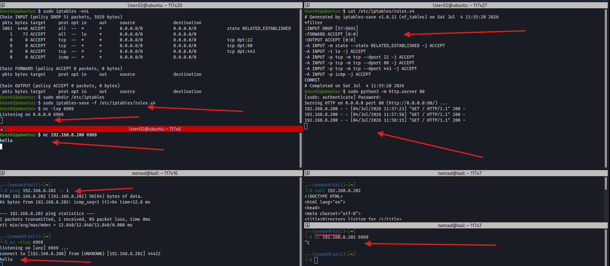
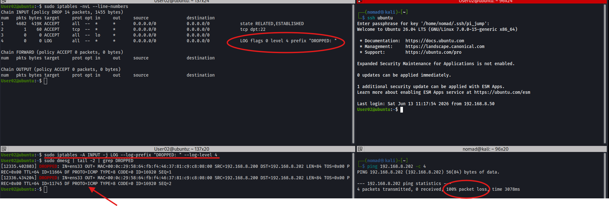
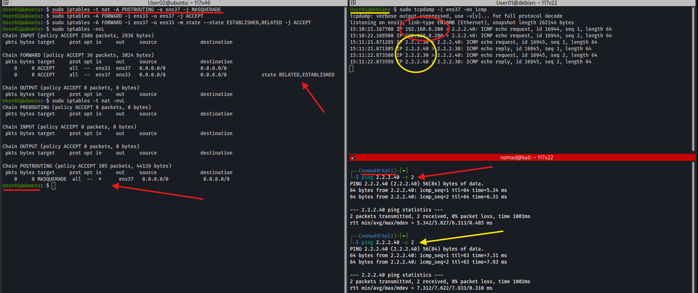

# iptables


## Overview

iptables is a Linux firewall and packet filtering tool that controls incoming, outgoing, and forwarded traffic using chains of rules. Rules are evaluated top to bottom, first match wins

Ref:
- https://www.booleanworld.com/depth-guide-iptables-linux-firewall/

**Tables:**
| Table | Purpose |
|---|---|
| `filter` | Default - controls what traffic is allowed (INPUT, FORWARD, OUTPUT) |
| `nat` | Network address translation (PREROUTING, POSTROUTING, OUTPUT) |
| `mangle` | Packet modification |

**Chains:**
| Chain | Traffic |
|---|---|
| `INPUT` | Incoming to this machine |
| `OUTPUT` | Outgoing from this machine |
| `FORWARD` | Passing through this machine |
| `PREROUTING` | Before routing decision |
| `POSTROUTING` | After routing decision |

---

## Common Commands

**Note, these were run in the Ubuntu VM:**

```bash
# View rules with line numbers and packet counts
sudo iptables -nvL --line-numbers

# View NAT table
sudo iptables -t nat -nvL --line-numbers

# Flush all rules
sudo iptables -F

# Flush NAT table
sudo iptables -t nat -F

# Delete rule by line number
sudo iptables -D INPUT 3

# Set default policy
sudo iptables -P INPUT DROP
sudo iptables -P INPUT ACCEPT
```

---

## Block All Traffic Except SSH

**Always add allow rules before setting DROP policy or you will lock yourself out**

```bash
# Allow established/related connections
sudo iptables -A INPUT -m state --state ESTABLISHED,RELATED -j ACCEPT

# Allow SSH
sudo iptables -A INPUT -p tcp --dport 22 -j ACCEPT

# Allow loopback
sudo iptables -A INPUT -i lo -j ACCEPT

# Now safe to drop everything else
sudo iptables -P INPUT DROP
```

**Verifying that SSH from Kali still works and ping is blocked:**
- ping 192.168.8.202 -> 100% packet loss



---

## Log Dropped Traffic

Add a LOG rule before the implicit DROP so blocked packets are recorded

The LOG rule needs to go after the ACCEPT rules
- It first logs then falls through to the default DROP policy

```bash
sudo iptables -A INPUT -j LOG --log-prefix "DROPPED: " --log-level 4

# Trigger some blocked traffic (ping from kali) then check the logs in ubuntu
sudo dmesg | tail -5 | grep DROPPED
```

**Log output:**
```
DROPPED: IN=ens33 OUT= MAC=... SRC=192.168.8.200 DST=192.168.8.202
PROTO=ICMP TTL=64 ID=11664 TYPE=8 CODE=0 SEQ=1
```

- `SRC` - source of the blocked packet (kali)
- `DST` - destination (ubuntu)
- `PROTO` - protocol that was blocked
- `TYPE=8` - ICMP echo request (ping)



---

## Masquerade / NAT

Rewrites the source IP of forwarded packets so they appear to come from the forwarding machine. Used for routing traffic through a gateway while hiding the original source

**Lab setup:**
- Kali (`192.168.8.200`)
- Ubuntu (`192.168.8.202` / `2.2.2.30`)
- Debian (`2.2.2.40`)

The masquerade on ubuntu rewrites kali's source IP to `2.2.2.30`
- Debian VM sees traffic as coming from ubuntu, not kali

```bash
# Edit kali rroutes - 2.2.2.0/24 through ubuntu instead of wireguard
sudo ip route del 2.2.2.0/24 dev wg0
sudo ip route add 2.2.2.0/24 via 192.168.8.202

# Make sure ip forwarding is enabled on ubuntu VM
sudo sysctl -w net.ipv4.ip_forward=1

# On Ubuntu - masquerade all traffic leaving ens37
sudo iptables -t nat -A POSTROUTING -o ens37 -j MASQUERADE

# Allow forwarding between interfaces
sudo iptables -A FORWARD -i ens33 -o ens37 -j ACCEPT
sudo iptables -A FORWARD -i ens37 -o ens33 -m state --state ESTABLISHED,RELATED -j ACCEPT

# Verify on debian - tcpdump shows source as 2.2.2.30 not 192.168.8.200
sudo tcpdump -i ens37 -nn icmp
# IP 2.2.2.30 > 2.2.2.40: ICMP echo request
# IP 2.2.2.40 > 2.2.2.30: ICMP echo reply
```



```bash
# Restore original routes on kali when done
sudo ip route del 2.2.2.0/24 via 192.168.8.202
sudo ip route add 2.2.2.0/24 dev wg0
```

---

## Key Flags

| Flag | Description |
|---|---|
| `-A` | Append rule to chain |
| `-I` | Insert rule at position (default position is 1 - top) |
| `-D` | Delete rule (i like to use --line-numbers to verify) |
| `-F` | Flush all rules in chain |
| `-P` | Set default policy |
| `-j` | Jump to target (ACCEPT, DROP, LOG, MASQUERADE) |
| `-p` | Protocol (tcp, udp, icmp) |
| `-s` | Source IP/subnet |
| `-d` | Destination IP/subnet |
| `--dport` | Destination port |
| `-i` | Input interface |
| `-o` | Output interface |
| `-t` | Table (filter, nat, mangle - default is filter) |
| `-n` | Numeric output |
| `-v` | Verbose |
| `-L` | List rules |

---

## Notes / Gotchas
- Rules are not persistent by default and are lost on reboot
	- Use`iptables-save` and `iptables-restore` or install `iptables-persistent` to make them survive reboots
  
- Always add ACCEPT rules before setting DROP policy

- `ESTABLISHED,RELATED` rule should be first
	- Lets existing connections continue even after DROP policy is set
  
- LOG does not drop the packet
	- It logs and continues to the next rule
	- Place as the last rule before the default DROP
  
- `-A` appends to the end, `-I` inserts at the top by default

- Masquerade requires `ip_forward=1` on the forwarding machine
	- Link to that writeup: [IPv4 Forwarding](ipv4-forwarding.md)
