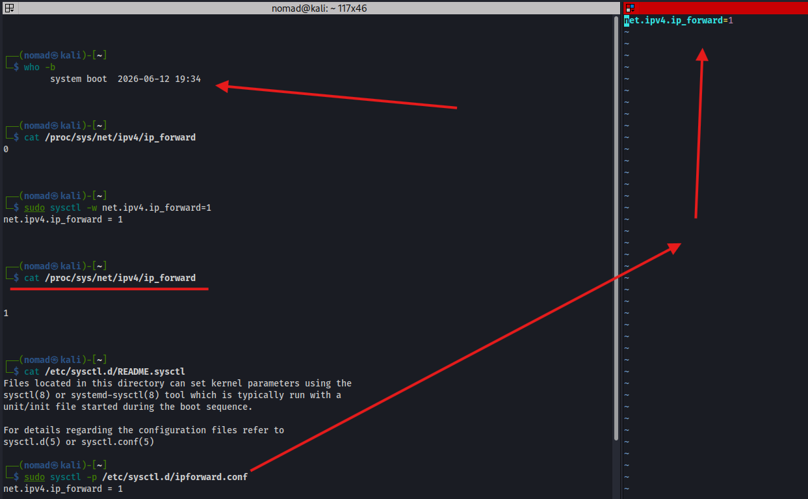
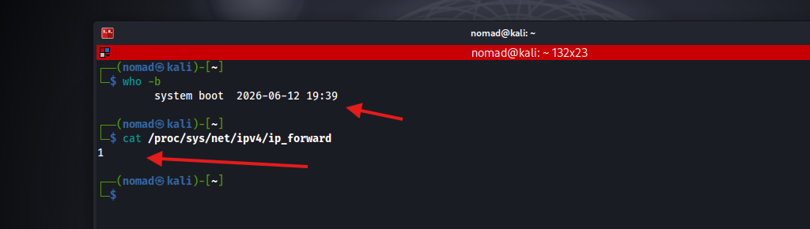

# Enable IPv4 Forwarding


## Overview

If a Linux system is being used as a firewall, router, or NAT device, it needs to be able to pass traffic between different networks instead of only handling traffic meant for itself
- This is controlled by the `net.ipv4.ip_forward` kernel setting, which enables or disables packet forwarding

Ref:
- https://linuxconfig.org/how-to-turn-on-off-ip-forwarding-in-linux

---

## Commands / Steps

```bash
# Check current value (0 = disabled, 1 = enabled)
cat /proc/sys/net/ipv4/ip_forward
0

# Enable temporarily (lost on reboot)
sudo sysctl -w net.ipv4.ip_forward=1

# Create a persistent sysctl config
sudo vim /etc/sysctl.d/ipforward.conf
# add 'net.ipv4.ip_forward=1'

# Apply config file without rebooting if not using -w
sudo sysctl -p /etc/sysctl.d/ipforward.conf

# Verify changes took place after reboot
cat /proc/sys/net/ipv4/ip_forward
1
```

---

## Screenshots






---

## Notes / Gotchas
- `/etc/sysctl.conf` may not exist, but there is a readme under the `/etc/sysctl.d/` directory that explains what to do:
```bash
  ┌──(nomad㉿kali)-[~]
└─$ cat /etc/sysctl.d/README.sysctl  
Files located in this directory can set kernel parameters using the
sysctl(8) or systemd-sysctl(8) tool which is typically run with a
unit/init file started during the boot sequence.

For details regarding the configuration files refer to
sysctl.d(5) or sysctl.conf(5)
```

- systemd-sysctl automatically loads settings from `/etc/sysctl.d/` during boot
- `sysctl -w` applies changes immediately but dont persist across reboots
- `sysctl -p` loads and applies configs from a specific file
- Without forwarding enabled, packets arriving on one interface destined for another network are dropped instead of forwarded
  - But, enabling IP forwarding only allows the kernel to route packets
  - Firewall, routing, or NAT rules might still be required to successfully pass traffic
- Repeated the steps above to enable MASQUARADING section: [iptables - Masquerade](iptables.md#masquerade--nat)