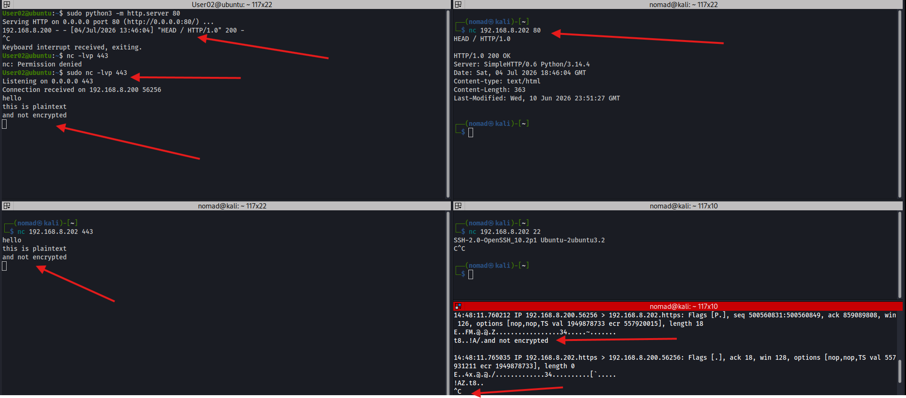

# netcat (nc)

Low-level TCP/UDP tool. Used for port checking, banner grabbing, file transfer, and as a network pipe/shell

## Port checking

```bash
# Test if SSH port is open on pi
nc -zv 192.168.8.50 22

# Test Ubuntu SSH port
nc -zv 192.168.8.202 22
```

|Flag|Description|
|----|----|
|`-z`|Zero I/O mode; just check if port is open but don't send data|
|`-l`|Listening for a connection|
|`-n`|No domain resolution|
|`-p`|Source port|
|`-v`|Verbose output|

**Output:**
- `open` - TCP connection succeeded, port is accepting connections
- `inverse host lookup failed` - no reverse DNS for that IP
- `Connection refused` - typically indicates the host is reachable but the port is closed

## Banner grabbing

```bash
# HTTP banner grab
nc 192.168.8.203 80
HEAD / HTTP/1.0
# hit enter twice

HTTP/1.0 200 OK
Server: SimpleHTTP/0.6 Python/3.14.4
Date: Sat, 04 Jul 2026 18:46:04 GMT
Content-type: text/html
Content-Length: 363
Last-Modified: Wed, 10 Jun 2026 23:51:27 GMT


# SSH banner grab
nc 192.168.8.202 22


SSH-2.0-OpenSSH_10.2p1 Ubuntu-2ubuntu3.2
```

## Pipe

Note, using port `443` because I specifically allowed only a handful of ports thru [iptables](iptables.md#)
- Notice that the port in the tcpdump shows https

```bash
User02@ubuntu:~$ sudo nc -lvp 443
Listening on 0.0.0.0 443
Connection received on 192.168.8.200 56256
hello
this is plaintext
and not encrypted
hi?


┌──(nomad㉿kali)-[~]
└─$ nc 192.168.8.202 443 
hello
this is plaintext
and not encrypted
hi?


└─$ sudo tcpdump -i eth0 host 192.168.8.202 and port 443 -A
tcpdump: verbose output suppressed, use -v[v]... for full protocol decode
listening on eth0, link-type EN10MB (Ethernet), snapshot length 262144 bytes
14:48:11.760212 IP 192.168.8.200.56256 > 192.168.8.202.https: Flags [P.], seq 500560831:500560849, ack 859089808, win 126, options [nop,nop,TS val 1949878733 ecr 557920015], length 18
E..FM.@.@.Z.................34.....~.......
t8..!A/.and not encrypted

...

14:52:45.669713 IP 192.168.8.202.https > 192.168.8.200.56256: Flags [P.], seq 11:15, ack 1, win 128, options [nop,nop,TS val 558205115 ecr 1950148264], length 4
E..8x.@.@./.............34..........h......
!E..t<..hi?
```



# Notes

- While doing a tcpdump on kali, you can see that the communication over netcat was not encrypted
- tcpdump -A flag prints packet contents in ASCII