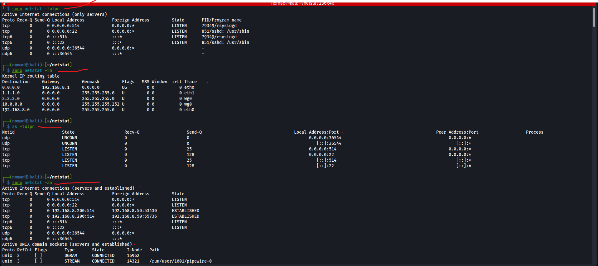
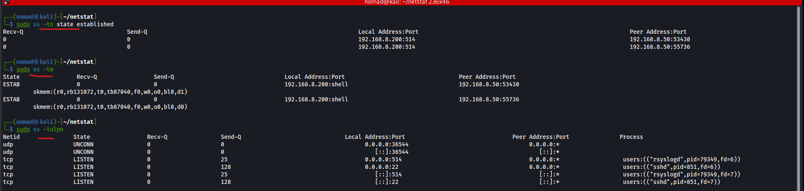

# Active Connections with netstat

## Overview

`netstat` prints network connections, routing tables, interface statistics, masquerade connections, and multicast memberships
- Is also considered legacy, updated method is `ss`

---

## netstat

```bash
# Show connections for tcp, udp, listening, associated pids, and dont resolve hostnames
sudo netstat -tulpn
Active Internet connections (only servers)
Proto        Recv-Q        Send-Q        Local Address        Foreign Address        State        PID/Program name    
tcp          0             0             0.0.0.0:514          0.0.0.0:*              LISTEN       79349/rsyslogd      
tcp          0             0             0.0.0.0:22           0.0.0.0:*              LISTEN        851/sshd: /usr/sbin 

# Show routing table, dont resolve hostnames
sudo netstat -rn   
Kernel IP routing table
Destination        Gateway        Genmask        Flags        MSS        Window        irtt        Iface
0.0.0.0            192.168.8.1    0.0.0.0        UG           0          0             0           eth0
2.2.2.0            0.0.0.0        255.255.255.0  U            0          0             0           wg0

# Show connections for all sockets (established/listening) and dont resolve hostnames
sudo netstat -an
Active Internet connections (servers and established)
Proto        Recv-Q        Send-Q        Local Address        Foreign Address        State      
tcp          0             0             192.168.8.200:514   192.168.8.50:53430      ESTABLISHED
tcp          0             0             192.168.8.200:514   192.168.8.50:55736      ESTABLISHED
Active UNIX domain sockets (servers and established)
Proto        RefCnt        Flags        Type        State        I-Node        Path
unix         3             [ ]          STREAM      CONNECTED    15609         /run/dbus/system_bus_socket
unix         3             [ ]          STREAM      CONNECTED    7985          /run/systemd/journal/stdout
```

|Output Column|Description|
|----|----|
|`Proto` | tcp / udp|
|`Local Address` |IP:port this machine is listening on|
|`0.0.0.0:22` | listening on all IPv4 interfaces (this one is port 22)|
|`:::22` | listening on all IPv6 interfaces|
|`127.0.0.1:631` | localhost only (not exposed to network)|
|`Foreign Address` | `0.0.0.0:*` means waiting for any connection|
|`State` | LISTEN / ESTABLISHED / TIME_WAIT / CLOSE_WAIT|
|`PID/Program name` | which process owns the socket|

- `LISTEN` - waiting for incoming connections
- `ESTABLISHED` - active connection, data can flow
- `TIME_WAIT` - connection closed, waiting for late packets to expire
- `CLOSE_WAIT` - remote side closed, local side hasn't yet

---

|Routing Flags|Description|
|----|----|
|`U`|Route is up|
|`G`|Uses a gateway|
|`H`|Host route (single host)|
|`!`|Reject route|

---

|Column|Description|
|----|----|
|`Recv-Q`|Data received by kernel but not yet read by application|
|`Send-Q`|Data queued for transmission or awaiting acknowledgement|

---

|Flag|Description|
|----|----|
|`-r, --route`|Display routing table|
|`-i, --interfaces`|Display interface table|
|`-g, --groups`|Display multicast group memberships|
|`-s, --statistics`|Display networking statistics (like SNMP)|
|`-M, --masquerade`|Display masqueraded connections|
|`-p, --programs`|Display PID/Program name for sockets (needs sudo)|
|`-l, --listening`|Display listening server sockets|
|`-a, --all`|Display listening and non-listening sockets|
|`-n, --numeric`|Don't resolve names|
|`-t|--tcp`|Display only tcp sockets|
|`-u|--udp`|Display udp sockets|

---

## ss

```bash
# Similar to netstat: show connections for tcp, udp, listening, associated pids, and dont resolve service names
sudo ss -tulpn
Netid        State        Recv-Q        Send-Q        Local Address:Port        Peer Address:Port        Process
tcp          LISTEN       0             25            0.0.0.0:514               0.0.0.0:*                users:(("rsyslogd",pid=79349,fd=6))                
tcp          LISTEN       0             128           0.0.0.0:22                0.0.0.0:*                users:(("sshd",pid=851,fd=6))                      

# Show established TCP connections only
sudo ss -tn state established
Recv-Q        Send-Q        Local Address:Port        Peer Address:Port
0             0             192.168.8.200:514         192.168.8.50:53430                               
0             0             192.168.8.200:514         192.168.8.50:55736                               

# Show socket memory usage
sudo ss -tm
State        Recv-Q        Send-Q        Local Address:Port        Peer Address:Port
ESTAB        0             0             192.168.8.200:shell       192.168.8.50:53430                
	 skmem:(r0,rb131072,t0,tb87040,f0,w0,o0,bl0,d1)                 
ESTAB        0             0             192.168.8.200:shell       192.168.8.50:55736                
	 skmem:(r0,rb131072,t0,tb87040,f0,w0,o0,bl0,d0)                 

# Kill a specific socket forcibly
sudo ss -K dst 192.168.8.50
```

|Flag|Description|
|----|----|
|`-n, --numeric`|Don't resolve service names|
|`-l, --listening`|Display listening sockets|
|`-p, --processes`|Show process using socket (need sudo)|
|`-4, --ipv4`|Display only IP version 4 sockets|
|`-6, --ipv6`|Display only IP version 6 sockets|
|`-t, --tcp`|Display only TCP sockets|
|`-u, --udp`|Display only UDP sockets|
|`-K, --kill`|Forcibly close sockets, display what was closed|

---

## Screenshots




---

## Notes / Gotchas

- `sudo` required for PID column, without it shows `-`
- `UNIX domain sockets` are local inter-process communication (IPC) channels that use filesystem paths instead of IP addresses and ports
- `0.0.0.0:PORT` means listening on all local IPv4 interfaces
- `127.0.0.1:PORT` means localhost services, services that dont need to be exposed to the entire network
- `netstat` and `ss` show active connections to raspberry pi for rsyslog
  - `192.168.8.200:514   192.168.8.50:53430      ESTABLISHED`
- `LISTEN` states identify services waiting for inbound connections
- `ESTABLISHED` states identify active sessions