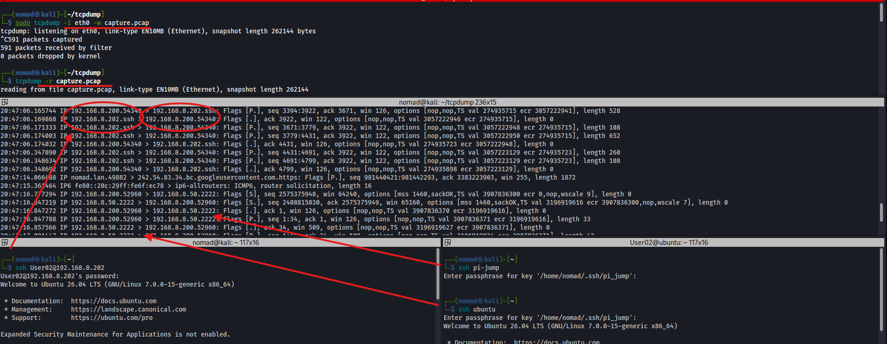
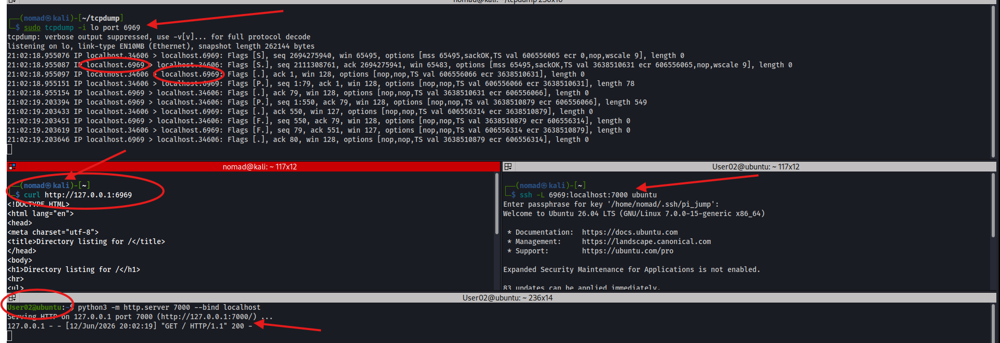
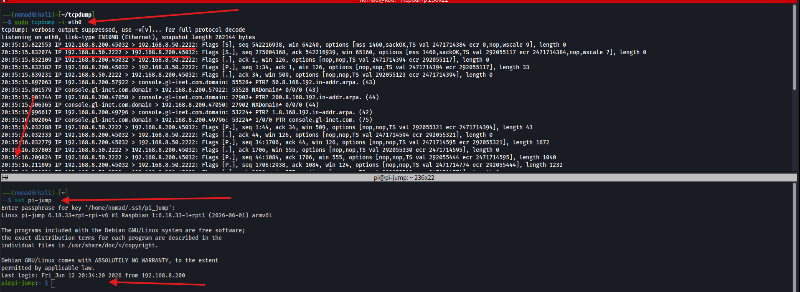
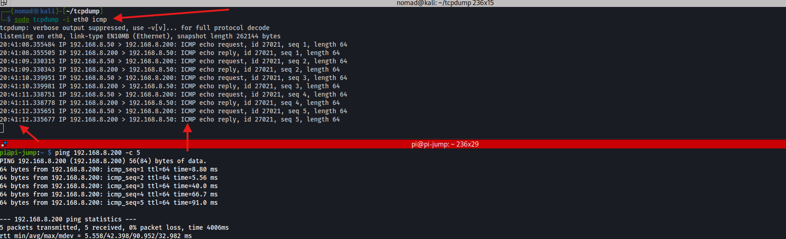
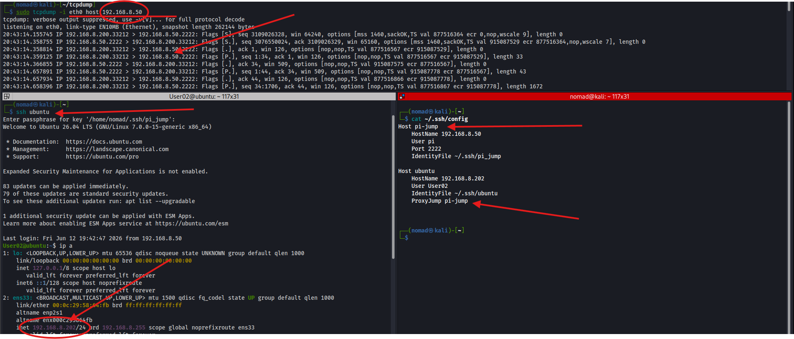

# tcpdump


## Overview

`tcpdump` captures and displays network packets in real time
- Used for troubleshooting connectivity, analyzing traffic, and verifying that expected traffic is flowing between systems
- Can also write to and read from .pcap files

Ref:
- https://linuxconfig.org/how-to-use-tcpdump-command-on-linux

---

## Commands / Steps

```bash
# Basic capture on interface
sudo tcpdump -i eth0

# Capture ICMP only (filter by protocol)
sudo tcpdump -i eth0 icmp

# Capture traffic to/from a specific host
sudo tcpdump -i eth0 host 192.168.8.50

# Capture traffic on a specific port
sudo tcpdump -i eth0 port 22

# Capture on loopback (local port forwarding traffic)
sudo tcpdump -i lo port 6969

# Write capture to file
sudo tcpdump -i eth0 -w capture.pcap

# Read capture file
tcpdump -r capture.pcap

# Combine filters and disable name resolution
sudo tcpdump -i eth0 host 192.168.8.202 and port 22 -nn
```

**Flags:**
| Flag | Description |
|---|---|
| `-i` | Interface to listen on (`-i any` for all) |
| `-nn` | Dont resolve hostnames or port names |
| `-w` | Write packets to file |
| `-r` | Read from file |
| `-v / -vv` | Verbose / extra verbose output |
| `-c` | Stop after N packets |
| `-A` | Print packet contents in ASCII |

---

## Output

```
20:41:08.355484 IP 192.168.8.50 > 192.168.8.200: ICMP echo request, id 27021, seq 1, length 64
20:41:08.355505 IP 192.168.8.200 > 192.168.8.50: ICMP echo reply, id 27021, seq 1, length 64
```

| Field | Meaning |
|---|---|
| `20:41:08.355484` | Timestamp |
| `192.168.8.50 > 192.168.8.200` | Source > Destination |
| `ICMP echo request` | Protocol and message type |
| `seq 1` | Sequence number |
| `length 64` | Packet size in bytes |

**TCP flags:**
| Flag | Meaning |
|---|---|
| `[S]` | SYN - connection initiation |
| `[.]` | ACK - acknowledgement |
| `[P.]` | PSH+ACK - application data being sent |
| `[F.]` | FIN - connection close |
| `[R.]` | RST - connection reset |

---

## Lab Demos

**Capture SSH connection to Pi:**
```bash
sudo tcpdump -i eth0 host 192.168.8.50
# In another terminal - ssh pi-jump or ubuntu since a proxyjump is configured
```


**Capture local port forwarding traffic:**
```bash
# ssh -L 6969:localhost:7000 ubuntu
# Ubuntu running `python3 -m http.server 7000 --bind localhost`
sudo tcpdump -i lo port 6969
# Back on kali: curl http://127.0.0.1:6969
# Shows full HTTP GET request/response on loopback curling our own localhost
```



---

## Screenshots







---

## Notes / Gotchas
- Requires `sudo` for packet capture on most systems
- `-nn` - hostname resolution slows output and might obscure the actual IPs
- SSH traffic is encrypted, so tcpdump can see the connection and packet metadata but not the transmitted commands or data
- Use Wireshark to open `.pcap` files for GUI analysis
- Loopback (`-i lo`) is needed to capture local port forwarding traffic since it never hits the physical interface
- Use `ip a` or `ip link` to grab interface names (`eth0`, `ens33`, `wlan0`, etc)