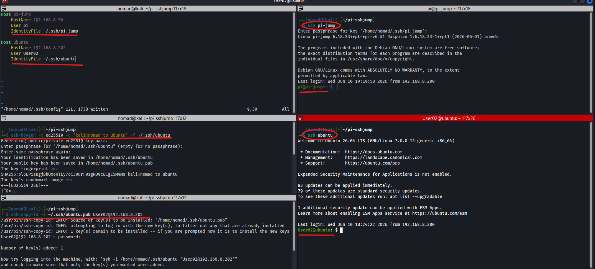
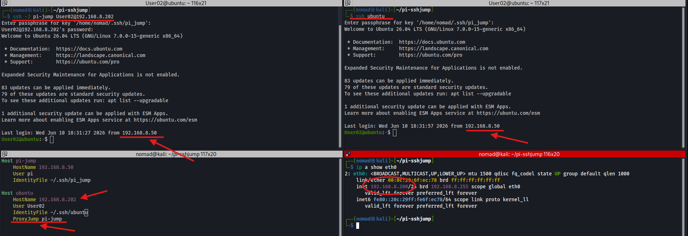
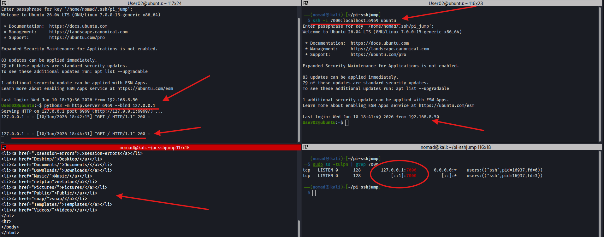
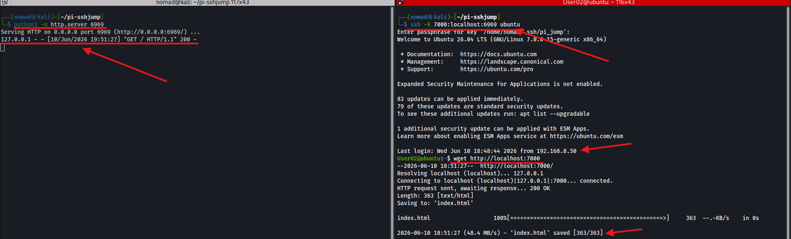
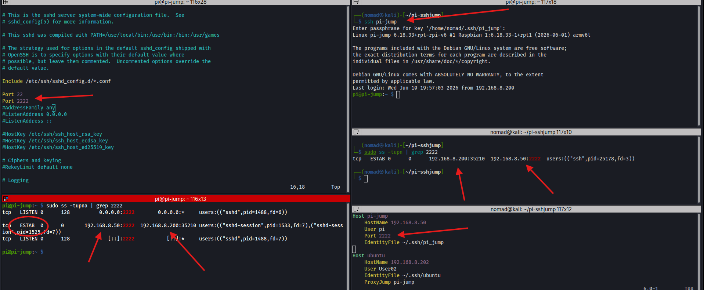
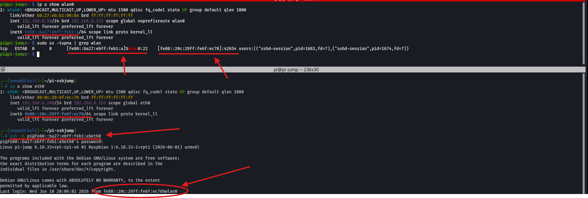

# SSH to a Remote Machine


## Overview

Secure Shell (SSH/22)
- The client config file (`~/.ssh/config`) lets you define named hosts so you dont have to type IPs, users, or key paths every time

---

## Key Generation / Setup

```bash
# Generate ed25519 keypairs
ssh-keygen -t ed25519 -C 'kali@nomad to pi' -f ~/.ssh/pi_jump
ssh-keygen -t ed25519 -C 'kali@nomad to ubuntu' -f ~/.ssh/ubuntu

# Copy public key to remote host
ssh-copy-id -i ~/.ssh/pi_jump.pub pi@192.168.8.50
ssh-copy-id -i ~/.ssh/ubuntu.pub User02@192.168.8.202

# Add keys to agent (avoids re entering passphrase each session)
eval $(ssh-agent)
ssh-add ~/.ssh/pi_jump
ssh-add ~/.ssh/ubuntu
```

---

## SSH Config File (~/.ssh/config)

```bash
Host pi-jump
    HostName 192.168.8.50
    User pi
    Port 2222
    IdentityFile ~/.ssh/pi_jump

Host ubuntu
    HostName 192.168.8.202
    User User02
    IdentityFile ~/.ssh/ubuntu
    ProxyJump pi-jump
```

```bash
chmod 600 ~/.ssh/config
```

`ssh pi-jump` and `ssh ubuntu` work without adding user, IP, port, or key each time. Ubuntu automatically routes through the Pi jump box woth the `ProxyJump` line

---

## Basic SSH

```bash
# Connect using config alias
ssh pi-jump
ssh ubuntu

# Connect explicitly (no config - using private key)
ssh -i ~/.ssh/pi_jump pi@192.168.8.50
```



---

## SSH Jump (-J)

Routes connection through a jump host to reach a target that may not be directly accessible

```bash
# Jump (without config)
ssh -J pi-jump User02@192.168.8.202

# With ProxyJump in config (automatic jump based on config file 'ProxyJump')
ssh ubuntu
```

`Last login: ... from 192.168.8.50` shows the connection came from the Pi and not the Kali machine directyly



---

## Local Port Forwarding (-L)

Binds a port on the `local` machine that forwards to a port on the `remote` machine through the SSH tunnel
- Use case: access a service on the remote host that is only listening on localhost

```bash
# On ubuntu - start a web server bound to localhost only
python3 -m http.server 6969 --bind 127.0.0.1

# On kali - forward local port 7000 to ubuntu port 6969
ssh -L 7000:localhost:6969 ubuntu

# In another kali terminal - access ubuntu service locally
curl http://localhost:7000

# Verify tunnel in netstat/ss
sudo ss -tulpn | grep 7000
tcp   LISTEN 0      128        127.0.0.1:7000       0.0.0.0:*    users:(("ssh",pid=16937,fd=6))
```



---

## Remote Port Forwarding (-R)

Binds a port on the `remote` machine that forwards back to a port on the `local` machine
- Use case: expose a local service to a remote host

```bash
# On kali - start web server
python3 -m http.server 6969

# On kali - bind port 7000 on ubuntu to forward back to kali port 6969
ssh -R 7000:localhost:6969 ubuntu

# On ubuntu - access kali web server through the tunnel
wget http://localhost:7000
```



---

## Non-Standard Port

```bash
# Add second port (uncomment 22) to Pi /etc/ssh/sshd_config, then restart ssh service:
Port 22
Port 2222

sudo systemctl restart ssh

# Verify both ports listening (on Pi)
sudo ss -tupna | grep 2222
tcp   LISTEN 0      128          0.0.0.0:2222        0.0.0.0:*     users:(("sshd",pid=1488,fd=6))                                       

# Connect from kali on port 2222
ssh -p 2222 pi@192.168.8.50

# Works with local kali config file since we added 'Port 2222' to it
ssh pi-jump

# On pi - verify established conection
sudo ss -tupna | grep 2222
tcp   ESTAB  0      0       192.168.8.50:2222  192.168.8.200:35210 users:(("sshd-session",pid=1533,fd=7),("sshd-session",pid=1525,fd=7))
```



---

## SSH to IPv6 Address

We need to specifiy the link local IPv6 addresses with `%`

```bash
# Get Pi IPv6 address (using 2.4ghz on pi)
ip a show wlan0
inet6 fe80::ba27:ebff:feb1:a/64

# Get kali IPv6 address (needed for outbound interface)
ip a show eth0
inet6 fe80::20c:29ff:fe6f:ec78/64

# ssh to Pi using IPv6 (specify outbound interface with %)
ssh -6 pi@fe80::ba27:ebff:feb1:a%eth0

# Confirm on Pi - last login shows Kali's IPv6 address
# Last login: ... from fe80::20c:29ff:fe6f:ec78%wlan0

# On pi - verify ipv6 established conection
sudo ss -tupna | grep wlan
tcp   ESTAB  0      0      [fe80::ba27:ebff:feb1:a]%wlan0:22    [fe80::20c:29ff:fe6f:ec78]:42654 users:(("sshd-session",pid=1683,fd=7),("sshd-session",pid=1674,fd=7))
```



---

## Agent Forwarding (-A)

Forwards your local ssh agent to the remote host so you can use your local keys to ssh onward without copying keys to the jump box

```bash
# On kali - add identity to pi-jump config
ssh-add ~/.ssh/pi_jump
Enter passphrase for /home/nomad/.ssh/pi_jump: 
Identity added: /home/nomad/.ssh/pi_jump (kali@nomad-to-pi)

# On kali - add identity to ubuntu config
ssh-add ~/.ssh/ubuntu
Identity added: /home/nomad/.ssh/ubuntu (kali@nomad to ubuntu)

# Connect to Pi with agent forwarding
ssh -A pi-jump

# From Pi - SSH to ubuntu using kali forwarded keys
ssh User02@192.168.8.202
```

---

## Notes / Gotchas
- `chmod 600 ~/.ssh/config` is required - SSH will refuse to use the config if permissions are too open
- Link-local IPv6 (`fe80::`) needs`%int` suffix
- `ProxyJump` in config automatically routes through the the box configured
- Agent forwarding (`-A`) is convenient but can be a security risk on untrusted hosts - anyone with root on the jump box can use the forwarded agent
- Port 2222 on the Pi requires both `Port 22` and `Port 2222` in sshd_config
  - adding 2222 alone without keeping 22 will lock you out if your config still points to 22
--- 
- Ref:
  - https://www.ssh.com/academy/ssh
