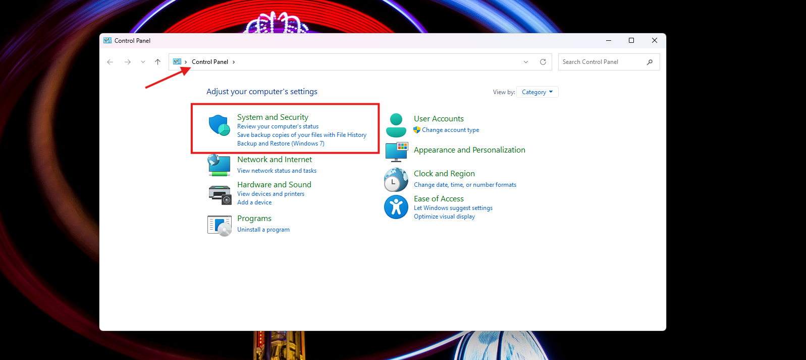
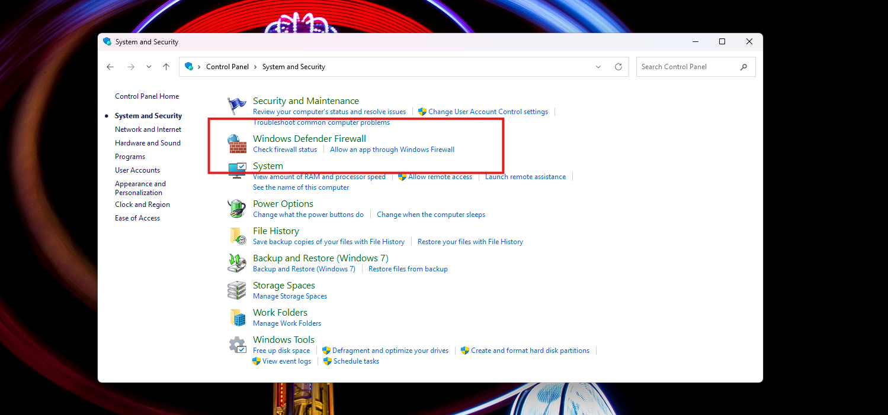
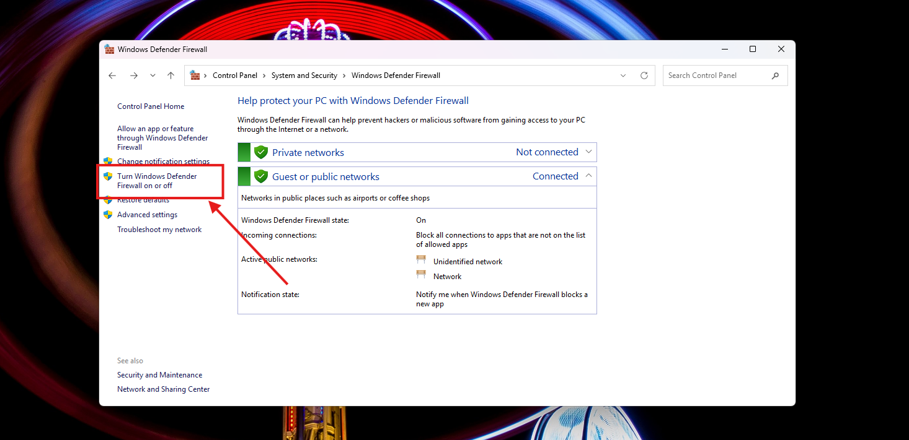
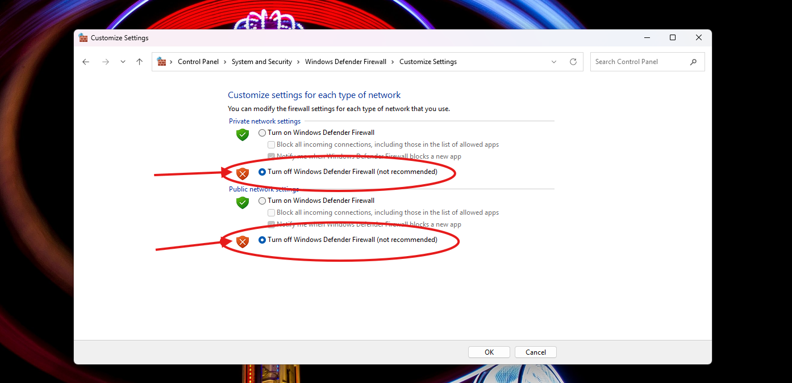
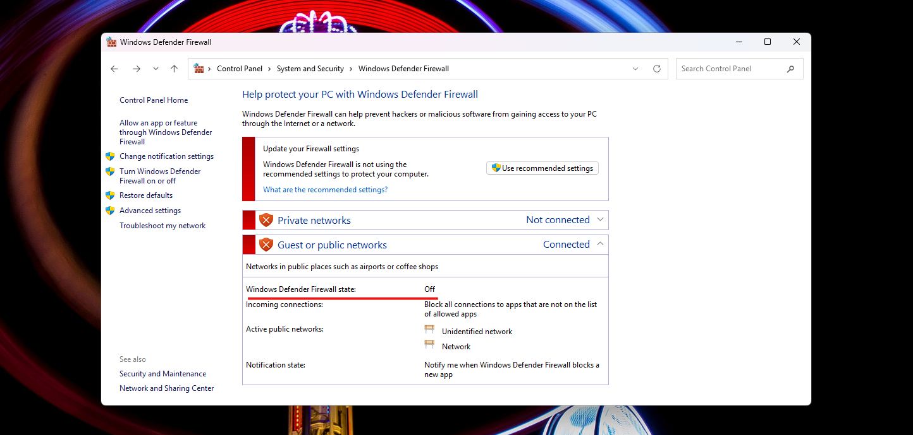
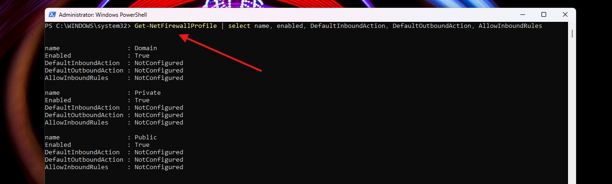
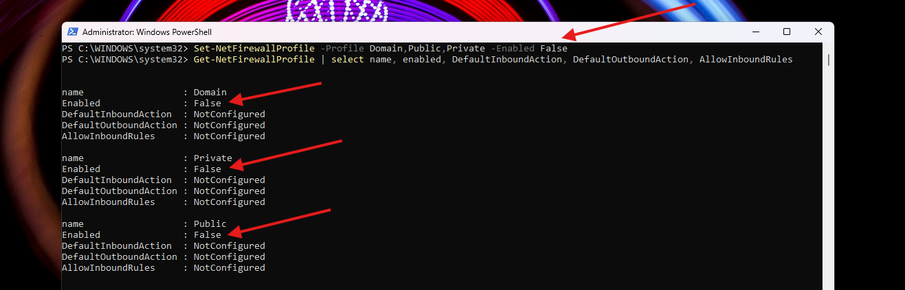

# Disable Windows Firewall

---

## GUI Method

1. Open **Control Panel** and click **System and Security**



2. Click **Windows Defender Firewall**



3. Click **Turn Windows Defender Firewall on or off**



4. Select **Turn off Windows Defender Firewall (not recommended)** for both Private and Public network settings



5. Click **OK**

Verify firewall status changes from On to Off:



---

## PowerShell Method

```powershell
# Check current status of all profiles
# Can just use Get-NetFirewallProfile but selecting the specific properties cleaned up the output for demo
Get-NetFirewallProfile | select name, enabled, DefaultInboundAction, DefaultOutboundAction, AllowInboundRules

# Disable all three profiles (Domain, Private, Public)
Set-NetFirewallProfile -Profile Domain,Public,Private -Enabled False

# Verify
Get-NetFirewallProfile | select name, enabled, DefaultInboundAction, DefaultOutboundAction, AllowInboundRules
```

**Before:**
```
name: Domain    Enabled: True
name: Private   Enabled: True
name: Public    Enabled: True
```



**After:**
```
name: Domain    Enabled: False
name: Private   Enabled: False
name: Public    Enabled: False
```



---

## Notes / Gotchas

- Windows has three firewall profiles: **Domain**, **Private**, **Public**
  - each can be configured independently
- `Set-NetFirewallProfile` requires PowerShell running as Administrator
- GUI method requires toggling both Private and Public network settings separately
- Re-enable with: `Set-NetFirewallProfile -Profile Domain,Public,Private -Enabled True`
- Disabling the firewall removes all inbound/outbound filtering