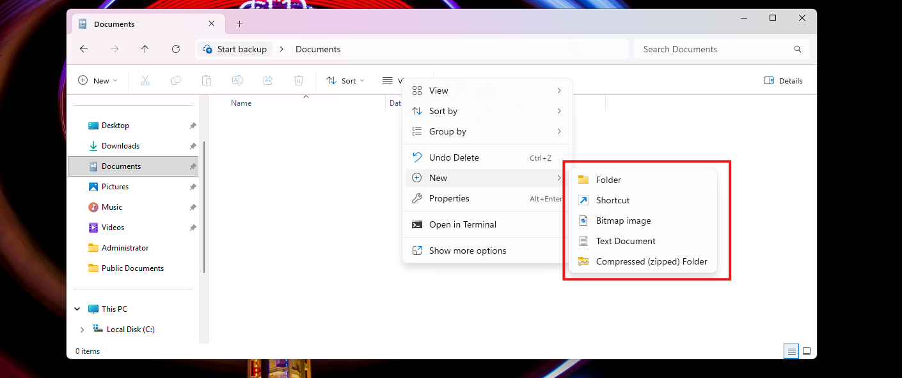
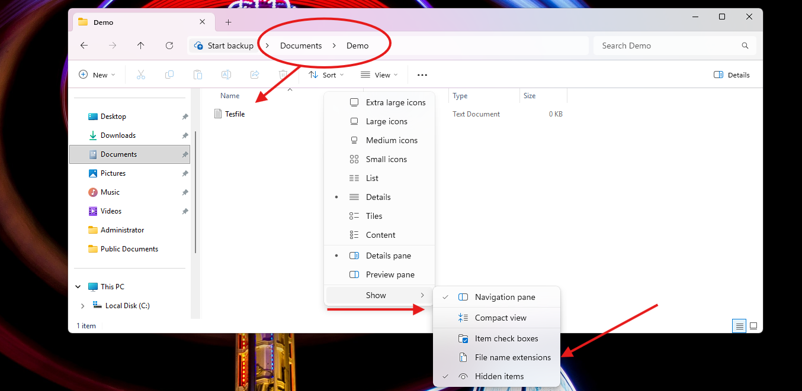
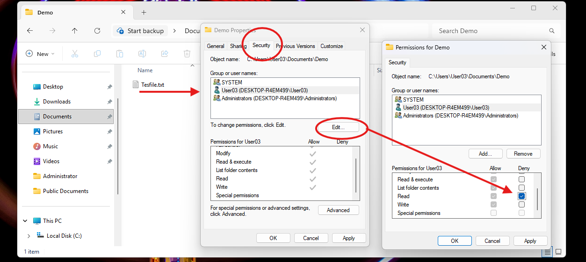
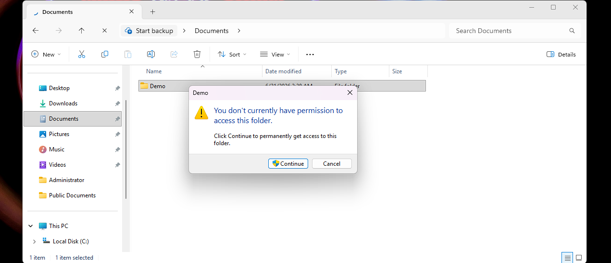
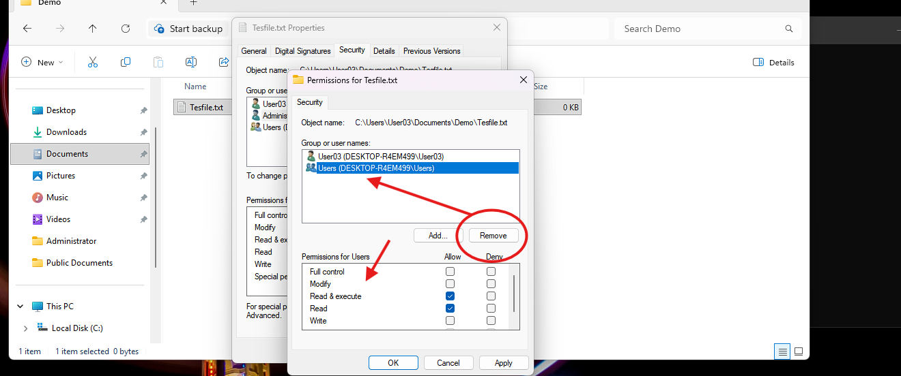
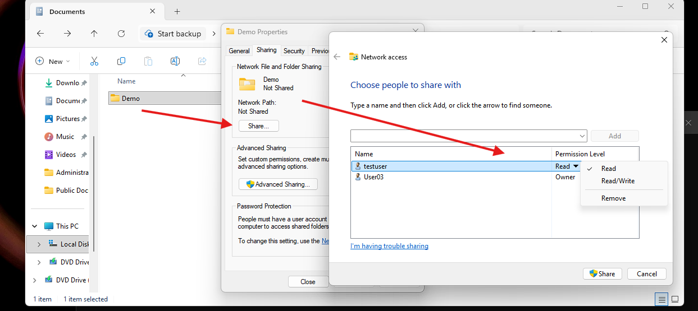
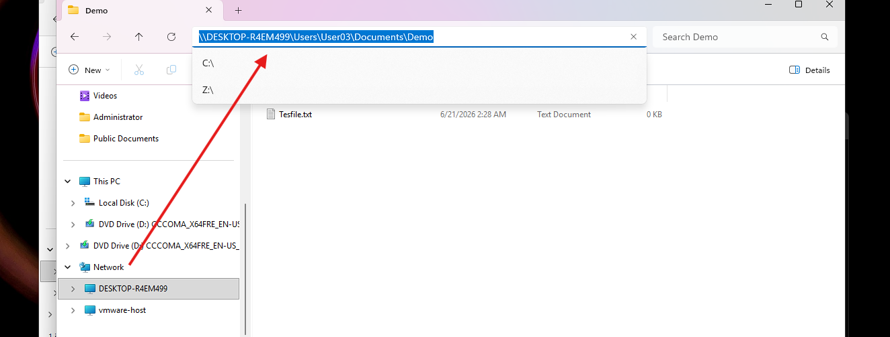

# Windows Explorer (GUI)


## Create a File

1. Right click inside a folder
2. Select **New**
3. Choose **Text Document** (or something)



---

## Show File Extensions / Hidden Files

1. Open the **View** menu in the file explorer
2. Go to **Show**
3. Check **File name extensions** / **Hidden items**



---

## Change Permissions on a File

1. Right click the file and select **Properties**
2. Go to the **Security** tab
3. Click **Edit** to open the **Permissions** dialog
4. Select a user or group, check **Allow** or **Deny** boxes for the desired permission level
5. Click **Apply**



### Oops denied myself




To recover, remove the deny entry or take ownership with `icacls` from an Admin CMD:
```cmd
takeown /F C:\Users\User03\Documents\Demo /R /A
icacls C:\Users\User03\Documents\Demo /grant User03:F /T
```

Also shown in the [Windows-Cli writeup](windows-cli.md#change-file-permissions-icacls)



---

## Share a Directory

1. Right click the folder and select **Properties**
2. Go to the **Sharing** tab
3. Click **Share**
4. In the **Network access** box, add a user and set their permission level (**Read** or **Read/Write**)
5. Click **Share**, then **Close**



Verify the share from another machine using its UNC path, or locally by checking **Network** in file explorer sidebar



---

## Notes / Gotchas
- Denying a permission in the Security tab takes effect immediately and can lock out the currently logged in user, including yourself, if the deny applies to a group you belong to
- File name extensions and hidden items are both toggled from **View > Show** submenu
- Sharing a folder through the **Sharing** tab uses local Windows user accounts for permission control, the user must already exist on the machine to appear in the **Network access** box