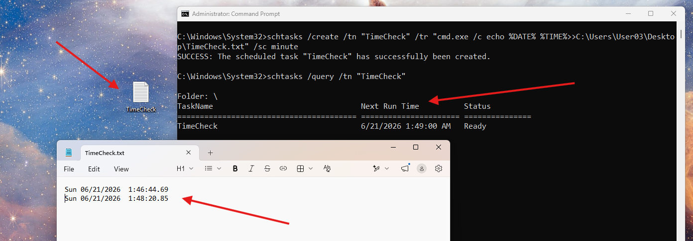

# Schedule a Recurring Task

## Overview

Can use `schtasks` to create, query, and delete scheduled tasks from CMD
- You can run specific terminal commands to run at certain times

---

## Commands / Steps

Create a recurring task that runs every minute and just logs date/time to a text file:
```cmd
schtasks /create /tn "TimeCheck" /tr "cmd.exe /c echo %DATE% %TIME%>>C:\Users\User03\Desktop\TimeCheck.txt" /sc minute

SUCCESS: The scheduled task "TimeCheck" has successfully been created.
```

Verify the task exists and check its next run time:
```cmd
schtasks /query /tn "TimeCheck"

Folder: \
TaskName                                 Next Run Time          Status
======================================== ====================== ===============
TimeCheck                                6/21/2026 1:49:00 AM   Ready
```

- Note, `schtasks /query` without a given task name will display all currently scheduled tasks

Confirm the task is actually executing:
```cmd
type C:\Users\User03\Desktop\TimeCheck.txt

Sun 06/21/2026  1:46:44.69
Sun 06/21/2026  1:48:20.85
Sun 06/21/2026  1:48:20.85
```



View full task details:
```cmd
schtasks /query /tn "TimeCheck" /v /fo list

Folder: \
HostName:                             DESKTOP-R4EM499
TaskName:                             \TimeCheck
Next Run Time:                        6/21/2026 1:54:00 AM
Status:                               Ready
Logon Mode:                           Interactive only
Last Run Time:                        6/21/2026 1:53:01 AM
Last Result:                          0
Author:                               DESKTOP-R4EM499\User03
Task To Run:                          cmd.exe /c echo Sun 06/21/2026  1:48:20.85>>C:\Users\User03\Desktop\TimeCheck.txt
Start In:                             N/A
Comment:                              N/A
Scheduled Task State:                 Enabled
Idle Time:                            Disabled
Power Management:                     Stop On Battery Mode, No Start On Batteries
Run As User:                          User03
Delete Task If Not Rescheduled:       Disabled
Stop Task If Runs X Hours and X Mins: 72:00:00
Schedule:                             Scheduling data is not available in this format.
Schedule Type:                        One Time Only, Minute
Start Time:                           1:48:00 AM
Start Date:                           6/21/2026
End Date:                             N/A
Days:                                 N/A
Months:                               N/A
Repeat: Every:                        0 Hour(s), 1 Minute(s)
Repeat: Until: Time:                  None
Repeat: Until: Duration:              Disabled
Repeat: Stop If Still Running:        Disabled
```

Delete a task:
```cmd
schtasks /delete /tn "TimeCheck" /f

SUCCESS: The scheduled task "TimeCheck" was successfully deleted.
```

---

## /sc Values

| Value | Frequency |
|---|---|
| `minute` | Every minute |
| `hourly` | Every hour |
| `daily` | Once a day |
| `weekly` | Once a week |
| `monthly` | Once a month |
| `once` | Single execution at a specified time |

---

## Notes / Gotchas
- `/tr` runs a single command execution
- Wrap logic in `cmd.exe /c "command1 && command2"` or point `/tr` at a `.bat`/`.ps1` file instead
- `/f` on `/delete` forces it
- Use `/v /fo list` for full task details
- This is separate from editing the Registry hives for things like boot persistence
