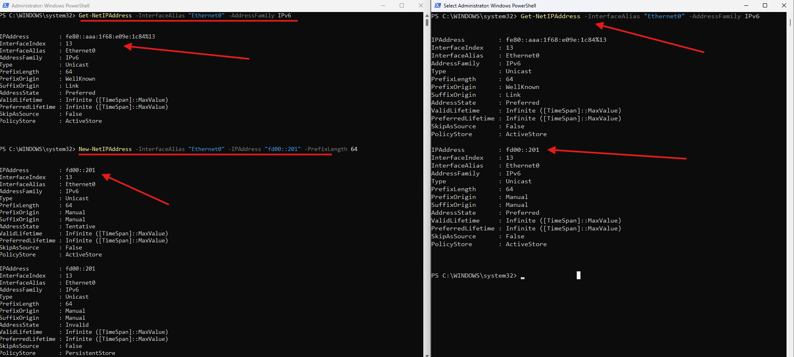

# Interface Configuration

## Overview

Windows interface configuration can be done via the GUI (ncpa.cpl) or PowerShell
Always verify adapter names with `Get-NetAdapter` before running PowerShell commands

---

## GUI - Ethernet0 (GLiNet)

Go to the adapter settings and set static values:

```
ncpa.cpl -> Double click Ethernet0 -> Properties -> IPv4
```

```
IP Address:  192.168.8.201
Subnet Mask: 255.255.255.0
Gateway:     192.168.8.1
DNS:         192.168.8.1
```

---

## PowerShell - Ethernet1 (vmnet1)

```powershell
# List adapters to verify correct names
Get-NetAdapter

# Assign static IP to the VMnet1 adapter
New-NetIPAddress -InterfaceAlias "Ethernet1" -IPAddress 1.1.1.20 -PrefixLength 24

# Add a persistent route to reach vmnet2 through the OpenVPN tunnel
route -p add 2.2.2.0 mask 255.255.255.0 172.16.20.1

# Verify
ipconfig
route print
ping 192.168.8.1
ping 1.1.1.10
```

### IPv6
```powershell
# Check existing IPv6
Get-NetIPAddress -InterfaceAlias "Ethernet0" -AddressFamily IPv6

# Assign static IPv6
New-NetIPAddress -InterfaceAlias "Ethernet0" -IPAddress "fd00::201" -PrefixLength 64

# Test IPv6 connectivity
ping fd00::200
```



| Command | Description |
|---------|-------------|
| `Get-NetAdapter` | List all adapters and their current state |
| `New-NetIPAddress` | Assign a static IP to a named adapter |
| `route -p add` | Add a persistent static route that survives reboot |
| `ipconfig` | Verify IP assignments on all interfaces |
| `route print` | Verify the full routing table |

---

## Notes / Gotchas

- Adapter names in PowerShell must match exactly, use `Get-NetAdapter` first to confirm
- `-p` flag on `route add` makes the route persistent across reboots
- If an address is already assigned, windows may reject a new config until the existing address is removed
  - Ex: `Remove-NetIPAddress -InterfaceAlias "Ethernet0" -IPAddress "fd00::201"`
- New-NetIPAddress persists automatically across reboots