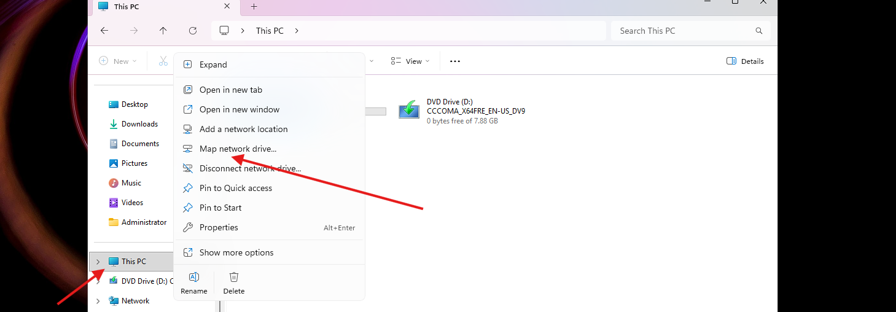
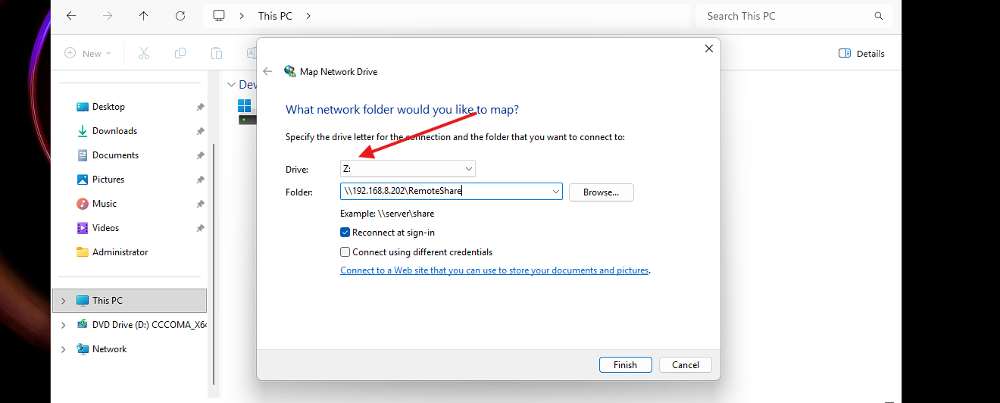
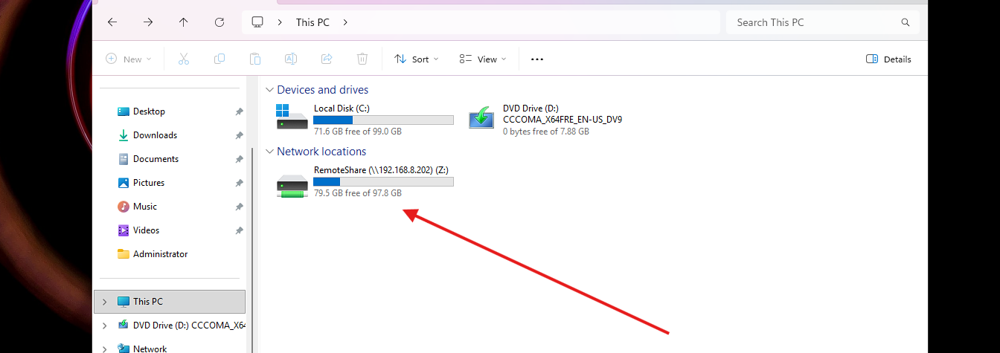

# Map a Network Drive

## GUI

1. Open **File Explorer**
2. Right click **This PC** then click **Map network drive**



3. Choose a drive letter
4. Folder: `\\192.168.8.202\RemoteShare` (or whatever youre connecting to)
5. Check **Reconnect at sign-in** for persistence



6. Click **Finish**



---

## CMD

```cmd
net use Z: \\192.168.8.202\RemoteShare /persistent:yes
The command completed successfully.
```

Verify the mapping:
```cmd
net use

Status       Local     Remote                             Network
-------------------------------------------------------------------------------
OK           Z:        \\192.168.8.202\RemoteShare        Microsoft Windows Network
```

Access the share like a local drive:
```cmd
dir Z:\

 Volume in drive Z is RemoteShare
 Directory of Z:\
06/20/2026  02:54 PM    <DIR>          .
06/20/2026  02:54 PM    <DIR>          ..
06/20/2026  02:54 PM                 5 remote test.txt

more "Z:\remote test.txt"
test
```

Remove the mapping:
```cmd
net use Z: /delete

Z: was deleted successfully.
```

---

## Powershell

```powershell
PS C:\WINDOWS\system32> New-PSDrive -Name "Z" -PSProvider FileSystem -Root "\\192.168.8.202\RemoteShare" -Persist

Name           Used (GB)     Free (GB) Provider      Root                                               CurrentLocation
----           ---------     --------- --------      ----                                               ---------------
Z                  18.28         79.59 FileSystem    \\192.168.8.202\RemoteShare


PS C:\WINDOWS\system32> Get-ChildItem Z:


    Directory: Z:\


Mode                 LastWriteTime         Length Name
----                 -------------         ------ ----
------         6/20/2026   2:54 PM              5 remote test.txt
```

---

## Notes / Gotchas

- Sometimes when `net use` is used to map a shared drive, the shared drive doesnt show up in the explorer
- Setting up Samba share from linux: [Link to writeup](../03-linux-storage-mounting/remote-drive-mount.md)