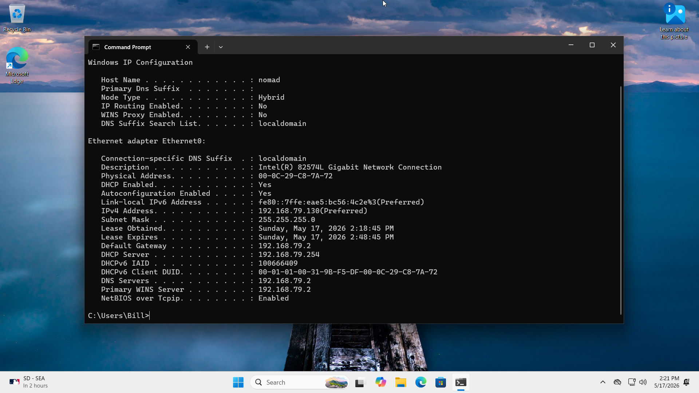

Fresh install for Win11
  - Had to run 'OOBE\BYPASSNRO' during install (SHIFT+F10)
    - This tells the OOBE process to allow skipping the network requirement -- if you dont, you'll have to sign in to a microsoft account
    - https://dev.to/alanwest/how-to-set-up-windows-11-without-a-microsoft-account-2026-edition-4c7a

