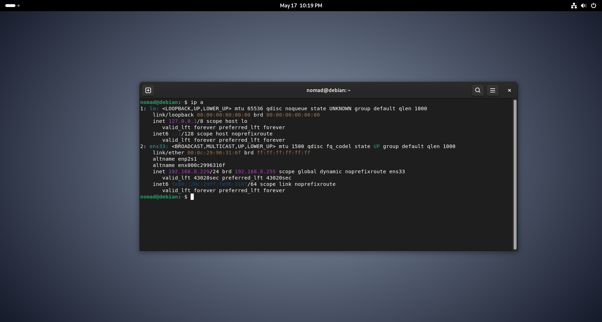

## Notes

Had to add my user to the sudo group after install:
- su - (get into root)
- sudo usermod -aG sudo nomad (add nomad user to sudo group)
- sudo addgrp sudo (refresh group)

Then can sudo in a new session

## IP Config

