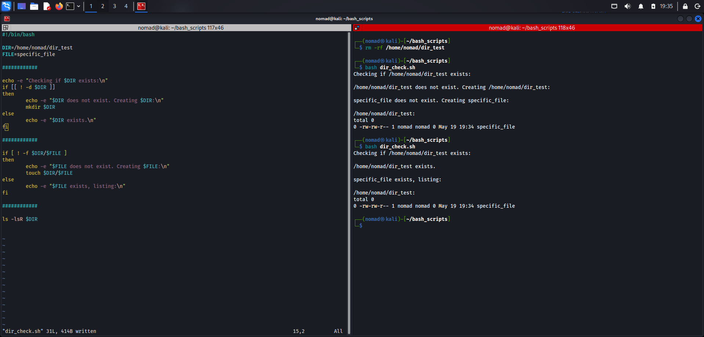
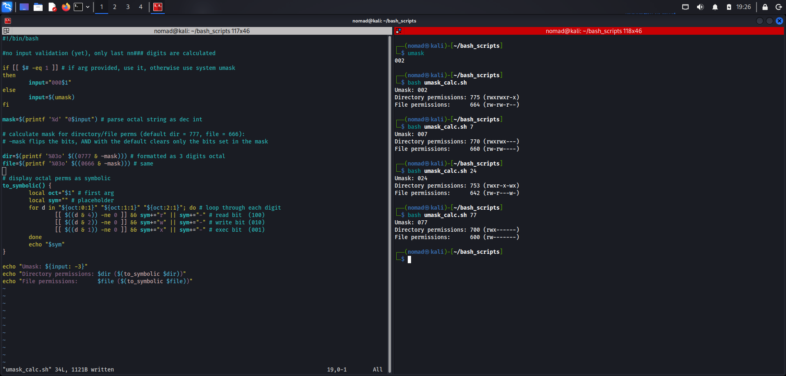

# Bash Scripts
Bash scripting projects

---

## Scripts

### `dir_check.sh`

Checks if a target directory exists/creates it if not. Then checks for a specific file inside that directory/creates it if missing. Prints a status message at each decision point and confirms any creation. Ends with a recursive `ls` of the directory to list contents and show creation.

**Output:**

### `umask_calk.sh`

Calculates and displays umask configuration based on either argument or system config, for both directory and file. Also displays associated symbolic permissions.

**Output:**

